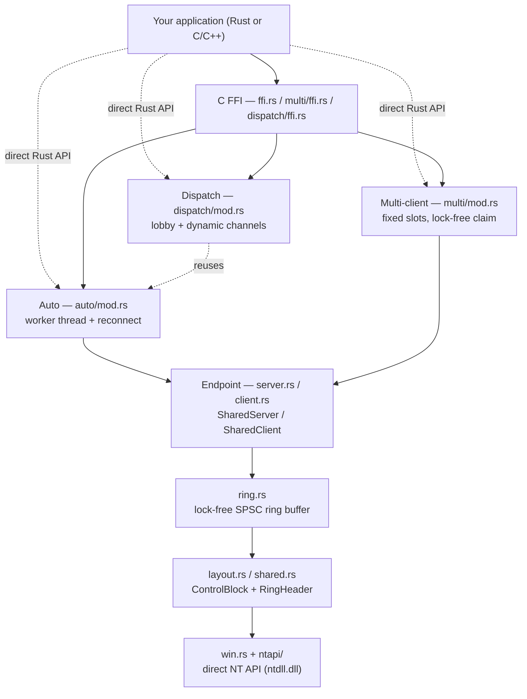
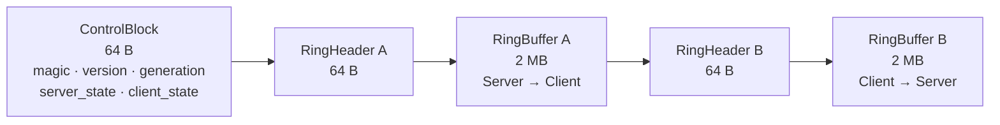
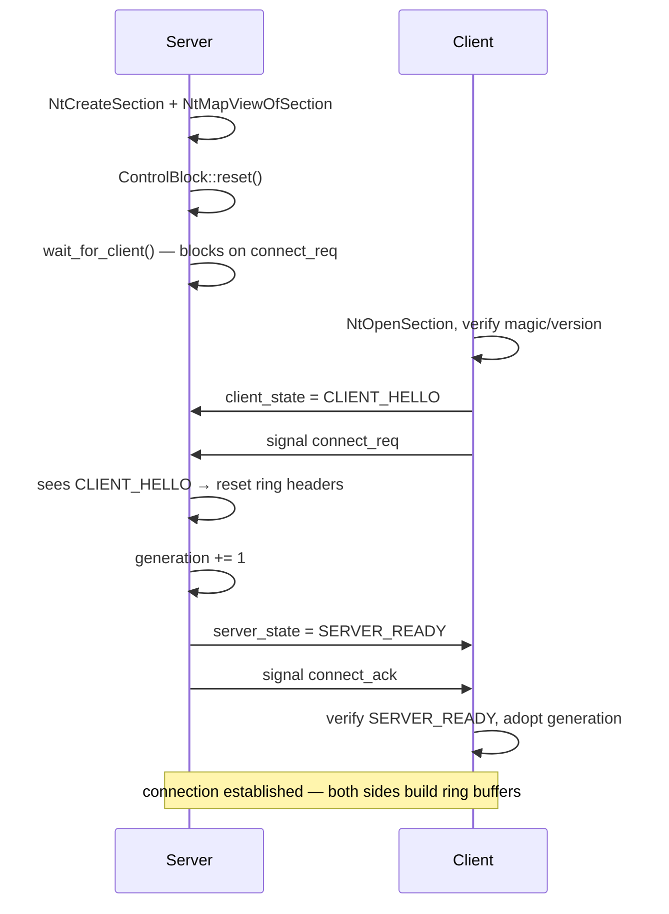
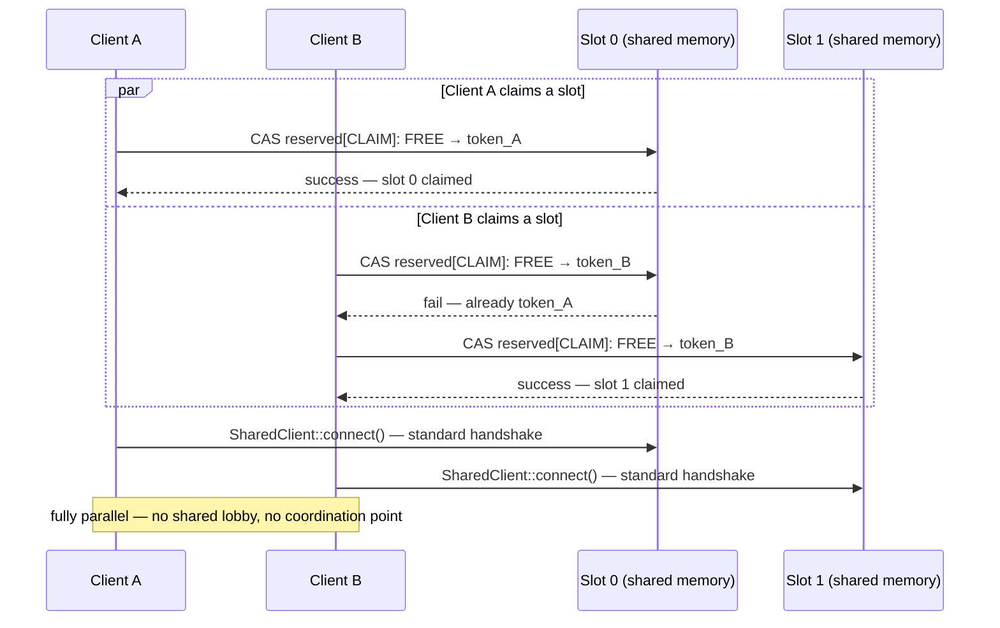

<div align="center">

# xShm

**High-performance cross-process shared memory IPC for Windows**

Bidirectional messaging over lock-free SPSC ring buffers, backed by direct NT API calls. Rust core, first-class C/C++ FFI.

<p>
  
  
  
  
  
</p>

<p>
  <a href="README.md"></a>
  <a href="README.ru.md"></a>
</p>

</div>

---

## 🆕 What's New in v0.6.0

- ✅ **Dispatch mode** — a fifth mode (`DispatchServer`/`DispatchClient`): one lobby + a dynamic per-client channel, no fixed upper bound on client count
- ✅ **Multi-client redesign** — the central lobby segment is gone. Clients now concurrently claim a free slot via lock-free CAS on the slot's own memory — fully parallel connects, no shared contention point
- ✅ **Hardening pass** — torn-read protection under ring overflow, dead/orphaned slot detection (liveness-checks the owning process), synchronous `stop()` (no more use-after-free through FFI on teardown), bounded send queues everywhere
- ✅ **API cleanup** (breaking, pre-1.0) — dropped dead fields, unified naming across modes (`poll_timeout`, `channel_name`), dropped the auto-generated name prefix — the caller now fully owns the visible NT object name
- ✅ **No admin privileges required** — named objects are session-scoped by default; elevated rights are only needed if you explicitly opt into `Global\`

## Features

- Cross-process channel with two ring buffers (server→client and client→server), each 2 MB
- Lock-free concurrent access: independent read/write, automatic overwrite on overflow, torn-read-safe under overflow (seqlock-style copy)
- Event-based synchronization via NT API for data/space/connection notifications
- Clean start guarantee: buffers reset on each new connection with generation tracking
- Ready-to-use C headers (`xshm.h`, `xshm_server.h`, `xshm_client.h`) with helper functions
- **Auto-mode**: background message processing with callbacks (`on_message`/`on_overflow`), automatic reconnect
- **Multi-client mode**: single server handles up to `MAX_MULTI_CLIENTS` (31) clients via lock-free concurrent slot claim
- **Dispatch mode**: single lobby + dynamic per-client channel, no fixed slot count at all
- **Direct NT API**: static linking with ntdll.dll, no external dependencies
- **Static CRT**: TLS and CRT statically linked, no runtime DLL dependencies

## Architecture



## Memory Layout

Each channel is a single Named (or anonymous) Section, mapped into both processes' address space:



Total: ~4 MB + headers, computed by `shared_mapping_size()`.

## How a Connection Is Established



## Choosing a Mode

| | Single-client | Auto | Multi-client | Dispatch |
|---|:---:|:---:|:---:|:---:|
| Clients per server | 1 | 1 | up to 31 (fixed slots) | unbounded |
| Threading | none — caller-driven | background worker | background worker per slot | lobby worker + per-client worker |
| Reconnect | manual | automatic | automatic (re-claim) | automatic |
| Connect cost | 1 handshake | 1 handshake | 1 CAS + 1 handshake | 1 lobby round-trip + 1 handshake |
| Best for | simplest pairwise IPC, driver integration | one peer, needs resilience | known/bounded fleet size | fleet size unknown ahead of time |

## Requirements

- Windows 10/11
- Rust 1.82+ (stable) — the codebase uses the `#[unsafe(...)]` attribute syntax; developed/tested against 1.96
- MSVC or MinGW toolchain
- **No administrator privileges required** — named kernel objects are session-scoped (`Local\` prefix → `\Sessions\<SessionId>\BaseNamedObjects\`). Elevated rights are only needed if you explicitly use the `Global\` prefix

## Dependencies

**Minimal dependencies** — only `thiserror` for error handling:

```toml
[dependencies]
thiserror = "2"
```

NT API calls are made directly via static linking with `ntdll.dll`:
- No SSN dependency
- No GetProcAddress at runtime
- No TLS (Thread Local Storage)

## Build

```bash
# Run tests
cargo test -- --test-threads=1   # sequential: tests share named-object namespaces

# Build static libraries
cargo build --release                                        # x64 MSVC (default)
cargo build --release --target i686-pc-windows-msvc          # x86 MSVC
cargo build --release --target x86_64-pc-windows-gnu         # x64 MinGW
```

Output files:

| Target | Debug | Release |
|--------|-------|---------|
| MSVC x64 | `target/debug/xshm.lib` | `target/release/xshm.lib` |
| MSVC x86 | `target/i686-pc-windows-msvc/debug/xshm.lib` | `target/i686-pc-windows-msvc/release/xshm.lib` |
| MinGW x64 | `target/x86_64-pc-windows-gnu/debug/libxshm.a` | `target/x86_64-pc-windows-gnu/release/libxshm.a` |

Headers are auto-generated via `cbindgen` during build.

## Rust Usage

```rust
use std::thread;
use std::time::Duration;
use xshm::{SharedClient, SharedServer};

fn main() -> xshm::Result<()> {
    let name = "ExampleChannel";

    let server_thread = thread::spawn({
        let name = name.to_owned();
        move || -> xshm::Result<()> {
            let mut server = SharedServer::start(&name)?;
            server.wait_for_client(Some(Duration::from_secs(5)))?;
            server.send_to_client(b"ping")?;
            let mut buffer = Vec::new();
            let len = server.receive_from_client(&mut buffer)?;
            println!("client -> server: {:?}", &buffer[..len]);
            Ok(())
        }
    });

    thread::sleep(Duration::from_millis(50));

    let client = SharedClient::connect(name, Duration::from_secs(5))?;
    let mut buffer = Vec::new();
    let len = client.receive_from_server(&mut buffer)?;
    println!("server -> client: {:?}", &buffer[..len]);
    client.send_to_server(b"pong")?;

    server_thread.join().unwrap()?;
    Ok(())
}
```

### Auto-mode (Rust)

```rust
use std::sync::Arc;
use xshm::{AutoClient, AutoHandler, AutoOptions, AutoServer, ChannelKind, Result};

struct Logger;

impl AutoHandler for Logger {
    fn on_message(&self, dir: ChannelKind, payload: &[u8]) {
        println!("[{:?}] {}", dir, String::from_utf8_lossy(payload));
    }
}

fn main() -> Result<()> {
    let handler = Arc::new(Logger);
    let server = AutoServer::start("AutoChannel", handler.clone(), AutoOptions::default())?;
    let client = AutoClient::connect("AutoChannel", handler, AutoOptions::default())?;

    client.send(b"hello")?;
    server.send(b"world")?;

    std::thread::sleep(std::time::Duration::from_millis(100));
    Ok(())
}
```

### Multi-client mode (Rust)

Fixed pool of slots (default 20, hard cap 31). Clients concurrently claim a
free slot via lock-free CAS — no central lobby, no negotiation round-trip:



```rust
use std::sync::Arc;
use xshm::multi::{MultiServer, MultiClient, MultiHandler, MultiClientHandler, MultiOptions, MultiClientOptions};
use xshm::Result;

struct ServerHandler;

impl MultiHandler for ServerHandler {
    fn on_client_connect(&self, client_id: u32) {
        println!("Client {} connected", client_id);
    }
    fn on_client_disconnect(&self, client_id: u32) {
        println!("Client {} disconnected", client_id);
    }
    fn on_message(&self, client_id: u32, data: &[u8]) {
        println!("Message from client {}: {:?}", client_id, data);
    }
}

struct ClientHandler;

impl MultiClientHandler for ClientHandler {
    fn on_connect(&self, slot_id: u32) {
        println!("Claimed slot {}", slot_id);
    }
    fn on_disconnect(&self) {
        println!("Disconnected");
    }
    fn on_message(&self, data: &[u8]) {
        println!("Received: {:?}", data);
    }
}

fn main() -> Result<()> {
    // Start multi-client server (default 20 slots)
    let server = MultiServer::start("MyService", Arc::new(ServerHandler), MultiOptions::default())?;

    // Each client claims a free slot on its own (base name is the same for all)
    let client1 = MultiClient::connect("MyService", Arc::new(ClientHandler), MultiClientOptions::default())?;
    let client2 = MultiClient::connect("MyService", Arc::new(ClientHandler), MultiClientOptions::default())?;
    let client3 = MultiClient::connect("MyService", Arc::new(ClientHandler), MultiClientOptions::default())?;

    println!("Client 1 slot: {}", client1.slot_id());
    println!("Client 2 slot: {}", client2.slot_id());
    println!("Client 3 slot: {}", client3.slot_id());

    // Send to specific client by slot_id
    server.send_to(0, b"Hello client 0")?;

    // Broadcast to all connected clients
    server.broadcast(b"Hello everyone")?;

    // Client sends to server
    client1.send(b"Hello server")?;

    std::thread::sleep(std::time::Duration::from_millis(100));
    Ok(())
}
```

### Dispatch mode (Rust)

One lobby + a dynamic `AutoServer`-backed channel per client. Unlike
Multi-client there is no fixed slot count — pick this mode when the number
of simultaneous clients isn't known ahead of time.

```rust
use std::sync::Arc;
use xshm::{
    ClientRegistration, DispatchClient, DispatchClientHandler, DispatchClientOptions,
    DispatchHandler, DispatchOptions, DispatchServer, Result,
};

struct ServerHandler;

impl DispatchHandler for ServerHandler {
    fn on_client_connect(&self, client_id: u32, info: &ClientRegistration) {
        println!("Client {} connected (pid {}, {})", client_id, info.pid, info.name);
    }
    fn on_client_disconnect(&self, client_id: u32) {
        println!("Client {} disconnected", client_id);
    }
    fn on_message(&self, client_id: u32, data: &[u8]) {
        println!("From {}: {:?}", client_id, data);
    }
}

struct ClientHandler;

impl DispatchClientHandler for ClientHandler {
    fn on_connect(&self, client_id: u32, channel_name: &str) {
        println!("Registered as client {} on channel {}", client_id, channel_name);
    }
    fn on_disconnect(&self) {
        println!("Disconnected");
    }
    fn on_message(&self, data: &[u8]) {
        println!("Received: {:?}", data);
    }
}

fn main() -> Result<()> {
    let server = DispatchServer::start("MyService", Arc::new(ServerHandler), DispatchOptions::default())?;

    let registration = ClientRegistration {
        pid: std::process::id(),
        revision: 1,
        name: "my_app".to_string(),
    };
    let client = DispatchClient::connect(
        "MyService",
        registration,
        Arc::new(ClientHandler),
        DispatchClientOptions::default(),
    )?;

    client.send(b"hello")?;
    server.broadcast(b"hello everyone")?;

    std::thread::sleep(std::time::Duration::from_millis(100));
    Ok(())
}
```

## C/C++ Integration

### Headers

```c
#include "xshm.h"          // Main header (includes all APIs)
#include "xshm_server.h"   // Server side (optional, included in xshm.h)
#include "xshm_client.h"   // Client side (optional, included in xshm.h)
```

Event handles for kernel driver integration are covered separately in
[Event Handles for Kernel Drivers](#event-handles-for-kernel-drivers) below.

### Linking

- MSVC: `xshm.lib` + `ntdll.lib`
- MinGW: `libxshm.a` + `-lntdll`

### Server Example (C)

```c
#include "xshm_server.h"
#include <stdio.h>

int main(void) {
    shm_endpoint_config_t cfg = xshm_server_config("MyShmChannel");
    shm_callbacks_t callbacks = xshm_server_callbacks_default();

    ServerHandle* server = shm_server_start(&cfg, &callbacks);
    if (!server) return 1;

    if (shm_server_wait_for_client(server, 5000) != SHM_SUCCESS) {
        shm_server_stop(server);
        return 1;
    }

    const char msg[] = "Hello client";
    shm_server_send(server, msg, sizeof msg);

    uint8_t buffer[1024];
    uint32_t len = sizeof buffer;
    if (shm_server_receive(server, buffer, &len) == SHM_SUCCESS) {
        printf("received %u bytes\n", len);
    }

    shm_server_stop(server);
    return 0;
}
```

### Client Example (C)

```c
#include "xshm_client.h"
#include <stdio.h>

int main(void) {
    shm_endpoint_config_t cfg = xshm_client_config("MyShmChannel");
    shm_callbacks_t callbacks = xshm_client_callbacks_default();

    ClientHandle* client = shm_client_connect(&cfg, &callbacks, 5000);
    if (!client) return 1;

    uint8_t buffer[1024];
    uint32_t len = sizeof buffer;
    if (shm_client_receive(client, buffer, &len) == SHM_SUCCESS) {
        printf("server says: %.*s\n", (int)len, buffer);
    }

    const char reply[] = "Hello server";
    shm_client_send(client, reply, sizeof reply);

    shm_client_disconnect(client);
    return 0;
}
```

### Multi-client Server (C)

```c
#include "xshm_server.h"
#include <stdio.h>

void on_connect(uint32_t client_id, void* user_data) {
    printf("Client %u connected\n", client_id);
}

void on_disconnect(uint32_t client_id, void* user_data) {
    printf("Client %u disconnected\n", client_id);
}

void on_message(uint32_t client_id, const void* data, uint32_t size, void* user_data) {
    printf("Message from client %u: %.*s\n", client_id, (int)size, (const char*)data);
}

int main(void) {
    shm_multi_callbacks_t callbacks = shm_multi_callbacks_default();
    callbacks.on_client_connect = on_connect;
    callbacks.on_client_disconnect = on_disconnect;
    callbacks.on_message = on_message;

    shm_multi_options_t options = shm_multi_options_default();
    options.max_clients = 20;  // default is 20, hard cap is 31

    MultiServerHandle* server = shm_multi_server_start("MyService", &callbacks, &options);
    if (!server) return 1;

    // Clients connect to "MyService" and concurrently claim a free slot
    // (no lobby round-trip) — see shm_multi_client_connect in xshm.h

    // Send to specific client
    shm_multi_server_send_to(server, 0, "Hello client 0", 14);

    // Broadcast to all
    uint32_t sent = 0;
    shm_multi_server_broadcast(server, "Hello all", 9, &sent);
    printf("Broadcast sent to %u clients\n", sent);

    // Get connected clients
    printf("Connected: %u clients\n", shm_multi_server_client_count(server));

    shm_multi_server_stop(server);
    return 0;
}
```

### Dispatch Server (C)

One lobby, no fixed slot count — a dynamic channel is created per client on
registration.

```c
#include "xshm_server.h"
#include <stdio.h>

void on_client_connect(uint32_t client_id, uint32_t pid, uint16_t revision,
                        const char* name, void* user_data) {
    printf("Client %u connected (pid %u, %s)\n", client_id, pid, name);
}

void on_message(uint32_t client_id, const void* data, uint32_t size, void* user_data) {
    printf("From %u: %.*s\n", client_id, (int)size, (const char*)data);
}

int main(void) {
    shm_dispatch_callbacks_t callbacks = xshm_dispatch_callbacks_default();
    callbacks.on_client_connect = on_client_connect;
    callbacks.on_message = on_message;

    shm_dispatch_options_t options = shm_dispatch_options_default();

    DispatchServerHandle* server = shm_dispatch_server_start("MyService", &callbacks, &options);
    if (!server) return 1;

    // Clients register via shm_dispatch_client_connect() — server hands out
    // a dynamically generated channel name per client, no slot limit

    uint32_t sent = 0;
    shm_dispatch_server_broadcast(server, "hello everyone", 14, &sent);

    shm_dispatch_server_stop(server);
    return 0;
}
```

## Constants

| Constant | Value | Description |
|----------|-------|-------------|
| `RING_CAPACITY` | 2 MB | Size of each ring buffer |
| `MAX_MESSAGES` | 500 | Max messages in queue |
| `MAX_MESSAGE_SIZE` | 65535 | Max message size (bytes) |
| `MIN_MESSAGE_SIZE` | 2 | Min message size (bytes) |
| `DEFAULT_MAX_CLIENTS` | 20 | Default slot count for `MultiServer` |
| `MAX_MULTI_CLIENTS` | 31 | Hard cap for `MultiServer` (`NtWaitForMultipleObjects` limit) |

## Event Handles for Kernel Drivers

Any named server can hand out its raw NT event handles so a kernel driver
can wait on them directly (event-driven, no polling) instead of going
through the FFI/Rust API for every notification.

**C API**:
```c
#include "xshm.h"

ServerHandle* server = shm_server_start(&config, NULL);

shm_event_handles_t event_handles = {0};
if (shm_server_get_event_handles(server, &event_handles)) {
    // event_handles.s2c_data - Server→Client data event (user signals driver)
    // event_handles.c2s_data - Client→Server data event (driver signals user)

    // Example: pass to a kernel driver via IOCTL
    request.ShmDataEventHandle = (HANDLE)event_handles.s2c_data;
    request.ShmSpaceEventHandle = (HANDLE)event_handles.c2s_data;
} else {
    // Anonymous server - no events available, use polling mode
}
```

**Rust API**:
```rust
use xshm::{SharedServer, EventHandles};

let server = SharedServer::start("MyChannel")?;
if let Some(handles) = server.get_event_handles() {
    // handles.s2c_data - Server→Client data event
    // handles.c2s_data - Client→Server data event
}
```

**Note**: For anonymous servers (`SharedServer::start_anonymous()`), this
returns `false`/`None` — no named events are created. Use polling mode in
that case.

## Limitations

- **SPSC**: Strictly one producer and one consumer per channel
- **Overwrite on overflow**: New messages evict oldest when queue is full
- **Windows only**: Uses direct NT API calls, relies on x86/x86_64 TSO memory ordering (not portable to ARM/RISC-V without rework)
- **Message size**: 2 to 65535 bytes
- **Anonymous servers**: No event handles available (polling mode only)
- **Multi-client slot count**: hard cap of 31 concurrent clients (`NtWaitForMultipleObjects` limit) — use Dispatch mode if you need more

## Project Structure

```
xshm/
├── .cargo/
│   └── config.toml     # Static CRT linking configuration
├── src/
│   ├── lib.rs          # Main module, public exports
│   ├── ntapi/          # Direct NT API layer (no external deps)
│   │   ├── mod.rs      # Module exports
│   │   ├── types.rs    # NT types (HANDLE, NTSTATUS, OBJECT_ATTRIBUTES...)
│   │   ├── funcs.rs    # NT function declarations (#[link(name = "ntdll")])
│   │   └── helpers.rs  # UNICODE_STRING, NtName, path conversion
│   ├── win.rs          # High-level wrappers (EventHandle, Mapping, is_process_alive)
│   ├── server.rs       # SharedServer endpoint
│   ├── client.rs       # SharedClient endpoint
│   ├── ring.rs         # Lock-free SPSC ring buffer
│   ├── layout.rs       # Shared memory structures
│   ├── events.rs       # Event synchronization
│   ├── ffi.rs          # C-compatible FFI layer (single-client + auto)
│   ├── error.rs        # Error types
│   ├── constants.rs    # Protocol constants
│   ├── naming.rs       # Kernel object naming
│   ├── shared.rs       # SharedView for mapped memory
│   ├── auto/
│   │   └── mod.rs      # Auto-mode with background workers
│   ├── multi/
│   │   ├── mod.rs      # MultiServer/MultiClient — fixed slots, concurrent claim
│   │   └── ffi.rs      # Multi-client C API
│   └── dispatch/
│       ├── mod.rs      # DispatchServer/DispatchClient — lobby + dynamic channels
│       ├── ffi.rs      # Dispatch C API
│       └── protocol.rs # Binary lobby registration protocol
├── include/
│   ├── xshm.h          # Main FFI header (auto-generated via cbindgen)
│   ├── xshm_server.h   # Server helpers (single/multi/dispatch)
│   └── xshm_client.h   # Client helpers (single/multi/dispatch)
├── tests/
│   ├── stress.rs       # Stress tests
│   ├── ordering.rs     # Memory ordering tests
│   └── multi.rs        # Multi-client tests
├── Cargo.toml
├── build.rs            # cbindgen integration
└── cbindgen.toml
```

## License

MIT
