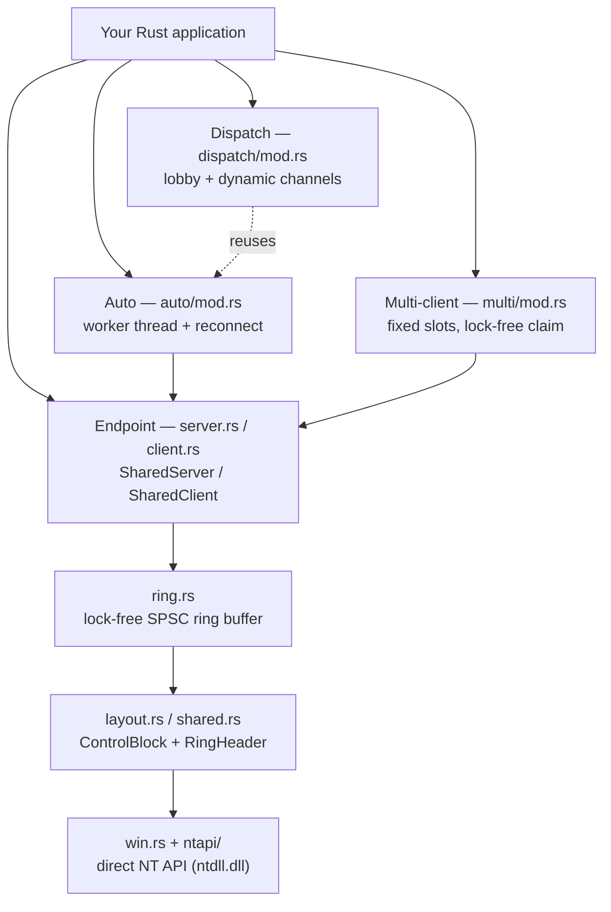
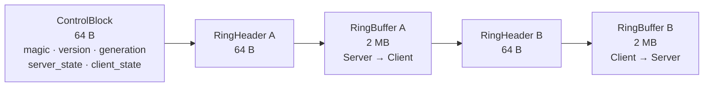
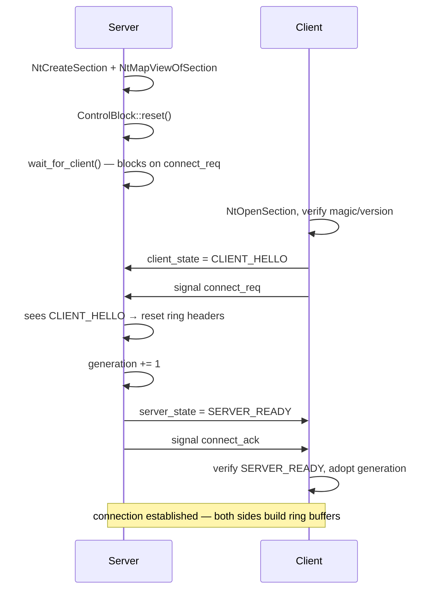
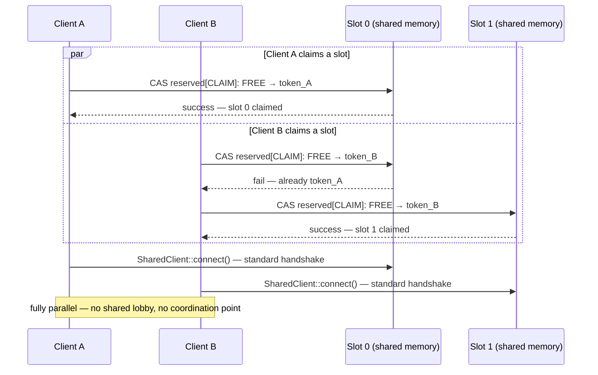

<div align="center">

# xShm

**High-performance cross-process shared memory IPC for Windows**

Bidirectional messaging over lock-free SPSC ring buffers, backed by direct NT API calls. A pure Rust crate — no C/C++ FFI.

<p>
  
  
  
  
  
</p>

<p>
  <a href="README.md"></a>
  <a href="README.ru.md"></a>
</p>

</div>

---

## 🆕 What's New in v0.8.0

- ✅ **Lossless writes** — `try_send_to_client` / `try_send_to_server` / `try_send` / `try_send_to` never overwrite unread data (`Err(QueueFull)` leaves the ring untouched); `free_space()` gives a conservative writer-side estimate; `wait_for_space()` sleeps on the `SPACE` event. Layout-compatible with 0.7.0 (`SHARED_VERSION` unchanged).
- ✅ **Reliable peer-crash detection** — peers exchange PIDs during the handshake and each side holds an open handle to the other's process; a killed/crashed peer is noticed within ~1–5 ms (see [Peer liveness](#peer-liveness)). New `DisconnectReason` (`Graceful` / `PeerDied` / `Local` / `Error`) via the default-method callbacks `on_disconnect_reason` / `on_client_disconnect_reason`, `is_peer_alive()` / `peer_pid()` accessors, `ShmError::PeerDied` from `wait_for_space` / `poll_*`. Wire-compatible with 0.7.0 / early 0.8.0 peers (they simply aren't watched).
- ✅ Ring constants (`RING_CAPACITY`, `MAX_MESSAGES`, `MAX_MESSAGE_SIZE`, …) are exported from the crate root.
- 🐛 Auto: a `send` with an invalid length no longer blocks the queue forever — it is dropped and reported via `on_error`.

## Previously in v0.7.0

- ✅ **Pure Rust crate** (breaking) — the entire C/C++ FFI layer is gone: `ffi.rs`, `multi/ffi.rs`, `dispatch/ffi.rs`, the `cbindgen` build step, the generated `include/*.h` headers and the `staticlib` crate type. `xshm` now builds as an `rlib` only and is consumed from Rust. A separate synchronous C23 project covers native consumers.
- ✅ **Zero build dependencies** — `build.rs` now does nothing but `cargo:rustc-link-lib=ntdll`; `thiserror` remains the only runtime dependency
- ✅ **Edition 2024 / modern Rust** — `unsafe extern` for NT imports, if-let chains, strict provenance (`.addr()` / `without_provenance_mut`) instead of `as` casts between ints and pointers, `MaybeUninit` + `spare_capacity_mut` instead of `set_len`-before-write, lint policy in the manifest with `undocumented_unsafe_blocks = "deny"`, `Debug` and `#[must_use]` across the public API
- ✅ **Full audit pass** — `Global\` naming actually works now (cross-session IPC was broken before), `Mapping::open` rejects undersized sections, `MultiClient::is_connected()`/`DispatchClient::is_connected()` stopped lying after teardown, send-queue overflow is reported through `on_overflow`, all `expect()` panics removed from worker threads

## Previously in v0.6.0

- ✅ **Dispatch mode** — a fifth mode (`DispatchServer`/`DispatchClient`): one lobby + a dynamic per-client channel, no fixed upper bound on client count
- ✅ **Multi-client redesign** — the central lobby segment is gone. Clients now concurrently claim a free slot via lock-free CAS on the slot's own memory — fully parallel connects, no shared contention point
- ✅ **Hardening pass** — torn-read protection under ring overflow, dead/orphaned slot detection (liveness-checks the owning process), synchronous `stop()` (no callback can fire after it returns), bounded send queues everywhere
- ✅ **API cleanup** (breaking, pre-1.0) — dropped dead fields, unified naming across modes (`poll_timeout`, `channel_name`), dropped the auto-generated name prefix — the caller now fully owns the visible NT object name
- ✅ **No admin privileges required** — named objects are session-scoped by default; elevated rights are only needed if you explicitly opt into `Global\`

## Features

- Cross-process channel with two ring buffers (server→client and client→server), each 2 MB
- Lock-free concurrent access: independent read/write, automatic overwrite on overflow, torn-read-safe under overflow (seqlock-style copy)
- Event-based synchronization via NT API for data/space/connection notifications
- Clean start guarantee: buffers reset on each new connection with generation tracking
- Handler traits instead of callback structs: `AutoHandler`, `MultiHandler`, `MultiClientHandler`, `DispatchHandler`, `DispatchClientHandler`
- **Auto-mode**: background message processing with callbacks (`on_message`/`on_overflow`), automatic reconnect
- **Multi-client mode**: single server handles up to `MAX_MULTI_CLIENTS` (31) clients via lock-free concurrent slot claim
- **Dispatch mode**: single lobby + dynamic per-client channel, no fixed slot count at all
- **Direct NT API**: static linking with ntdll.dll, no external dependencies
- **Static CRT**: TLS and CRT statically linked, no runtime DLL dependencies

## Architecture


```mermaid
flowchart TD
    App["Your Rust application"]
    App --> Auto["Auto — auto/mod.rs<br/>worker thread + reconnect"]
    App --> Multi["Multi-client — multi/mod.rs<br/>fixed slots, lock-free claim"]
    App --> Dispatch["Dispatch — dispatch/mod.rs<br/>lobby + dynamic channels"]
    App --> Endpoint

    Dispatch -. reuses .-> Auto

    Auto --> Endpoint["Endpoint — server.rs / client.rs<br/>SharedServer / SharedClient"]
    Multi --> Endpoint

    Endpoint --> Ring["ring.rs<br/>lock-free SPSC ring buffer"]
    Ring --> Layout["layout.rs / shared.rs<br/>ControlBlock + RingHeader"]
    Layout --> Platform["win.rs + ntapi/<br/>direct NT API (ntdll.dll)"]
```

## Memory Layout

Each channel is a single Named (or anonymous) Section, mapped into both processes' address space:


```mermaid
flowchart LR
    CB["ControlBlock<br/>64 B<br/>magic · version · generation<br/>server_state · client_state"]
    RHA["RingHeader A<br/>64 B"]
    RBA["RingBuffer A<br/>2 MB<br/>Server → Client"]
    RHB["RingHeader B<br/>64 B"]
    RBB["RingBuffer B<br/>2 MB<br/>Client → Server"]
    CB --> RHA --> RBA --> RHB --> RBB
```

Total: ~4 MB + headers, computed by `shared_mapping_size()`.

## How a Connection Is Established


```mermaid
sequenceDiagram
    participant S as Server
    participant C as Client

    S->>S: NtCreateSection + NtMapViewOfSection
    S->>S: ControlBlock::reset()
    S->>S: wait_for_client() — blocks on connect_req

    C->>C: NtOpenSection, verify magic/version
    C->>S: client_state = CLIENT_HELLO
    C->>S: signal connect_req

    S->>S: sees CLIENT_HELLO → reset ring headers
    S->>S: generation += 1
    S->>C: server_state = SERVER_READY
    S->>C: signal connect_ack

    C->>C: verify SERVER_READY, adopt generation
    Note over S,C: connection established — both sides build ring buffers
```

## Choosing a Mode

| | Single-client | Auto | Multi-client | Dispatch |
|---|:---:|:---:|:---:|:---:|
| Clients per server | 1 | 1 | up to 31 (fixed slots) | unbounded |
| Threading | none — caller-driven | background worker | background worker per slot | lobby worker + per-client worker |
| Reconnect | manual | automatic | automatic (re-claim) | automatic |
| Connect cost | 1 handshake | 1 handshake | 1 CAS + 1 handshake | 1 lobby round-trip + 1 handshake |
| Best for | simplest pairwise IPC, driver integration | one peer, needs resilience | known/bounded fleet size | fleet size unknown ahead of time |

## Channel Naming

The name you pass to any constructor becomes the kernel object name as-is; the
namespace is chosen by its prefix:

| You pass | Section object | Namespace |
|----------|----------------|-----------|
| `"Chan"` | `Local\Chan` | session-local |
| `"Local\Chan"` | `Local\Chan` | session-local (prefix is not doubled) |
| `"Global\Chan"` | `Global\Chan` | global — needed for cross-session IPC (service in session 0 ↔ desktop process) |
| `"\BaseNamedObjects\Chan"` | as-is | raw NT path |

Channel events always land in the same namespace as the section.

## Requirements

- Windows 10/11
- Rust 1.98+ (stable) — edition 2024 and `rust-version = "1.98"` in the manifest
- MSVC toolchain (MinGW targets were dropped in 0.7.0 together with the C ABI)
- **No administrator privileges required** — named kernel objects are session-scoped (`Local\` prefix → `\Sessions\<SessionId>\BaseNamedObjects\`). Elevated rights are only needed if you explicitly use the `Global\` prefix

## Dependencies

**Minimal dependencies** — only `thiserror` for error handling:

```toml
[dependencies]
thiserror = "2"
```

NT API calls are made directly via static linking with `ntdll.dll`:
- No SSN dependency
- No GetProcAddress at runtime
- No TLS (Thread Local Storage)

## Build

Add it as a path or git dependency:

```toml
[dependencies]
xshm = { path = "../xshm" }
```

```bash
cargo build --release                                   # x64 MSVC (default)
cargo build --release --target i686-pc-windows-msvc     # x86 MSVC

# Run tests
cargo test -- --test-threads=1   # sequential: tests share named-object namespaces
```

The crate builds as an `rlib` only. `build.rs` does one thing — `cargo:rustc-link-lib=ntdll` — so `ntdll` is linked into whatever binary consumes the crate.

## Rust Usage

```rust
use std::thread;
use std::time::Duration;
use xshm::{SharedClient, SharedServer};

fn main() -> xshm::Result<()> {
    let name = "ExampleChannel";

    let server_thread = thread::spawn({
        let name = name.to_owned();
        move || -> xshm::Result<()> {
            let mut server = SharedServer::start(&name)?;
            server.wait_for_client(Some(Duration::from_secs(5)))?;
            server.send_to_client(b"ping")?;
            let mut buffer = Vec::new();
            let len = server.receive_from_client(&mut buffer)?;
            println!("client -> server: {:?}", &buffer[..len]);
            Ok(())
        }
    });

    thread::sleep(Duration::from_millis(50));

    let client = SharedClient::connect(name, Duration::from_secs(5))?;
    let mut buffer = Vec::new();
    let len = client.receive_from_server(&mut buffer)?;
    println!("server -> client: {:?}", &buffer[..len]);
    client.send_to_server(b"pong")?;

    server_thread.join().unwrap()?;
    Ok(())
}
```

### Auto-mode

```rust
use std::sync::Arc;
use xshm::{AutoClient, AutoHandler, AutoOptions, AutoServer, ChannelKind, Result};

struct Logger;

impl AutoHandler for Logger {
    fn on_message(&self, dir: ChannelKind, payload: &[u8]) {
        println!("[{:?}] {}", dir, String::from_utf8_lossy(payload));
    }
}

fn main() -> Result<()> {
    let handler = Arc::new(Logger);
    let server = AutoServer::start("AutoChannel", handler.clone(), AutoOptions::default())?;
    let client = AutoClient::connect("AutoChannel", handler, AutoOptions::default())?;

    client.send(b"hello")?;
    server.send(b"world")?;

    std::thread::sleep(std::time::Duration::from_millis(100));
    Ok(())
}
```

### Multi-client mode

Fixed pool of slots (default 20, hard cap 31). Clients concurrently claim a
free slot via lock-free CAS — no central lobby, no negotiation round-trip:


```mermaid
sequenceDiagram
    participant A as Client A
    participant B as Client B
    participant S0 as Slot 0 (shared memory)
    participant S1 as Slot 1 (shared memory)

    par Client A claims a slot
        A->>S0: CAS reserved[CLAIM]: FREE → token_A
        S0-->>A: success — slot 0 claimed
    and Client B claims a slot
        B->>S0: CAS reserved[CLAIM]: FREE → token_B
        S0-->>B: fail — already token_A
        B->>S1: CAS reserved[CLAIM]: FREE → token_B
        S1-->>B: success — slot 1 claimed
    end

    A->>S0: SharedClient::connect() — standard handshake
    B->>S1: SharedClient::connect() — standard handshake
    Note over A,B: fully parallel — no shared lobby, no coordination point
```

```rust
use std::sync::Arc;
use xshm::multi::{MultiServer, MultiClient, MultiHandler, MultiClientHandler, MultiOptions, MultiClientOptions};
use xshm::Result;

struct ServerHandler;

impl MultiHandler for ServerHandler {
    fn on_client_connect(&self, client_id: u32) {
        println!("Client {} connected", client_id);
    }
    fn on_client_disconnect(&self, client_id: u32) {
        println!("Client {} disconnected", client_id);
    }
    fn on_message(&self, client_id: u32, data: &[u8]) {
        println!("Message from client {}: {:?}", client_id, data);
    }
}

struct ClientHandler;

impl MultiClientHandler for ClientHandler {
    fn on_connect(&self, slot_id: u32) {
        println!("Claimed slot {}", slot_id);
    }
    fn on_disconnect(&self) {
        println!("Disconnected");
    }
    fn on_message(&self, data: &[u8]) {
        println!("Received: {:?}", data);
    }
}

fn main() -> Result<()> {
    // Start multi-client server (default 20 slots)
    let server = MultiServer::start("MyService", Arc::new(ServerHandler), MultiOptions::default())?;

    // Each client claims a free slot on its own (base name is the same for all)
    let client1 = MultiClient::connect("MyService", Arc::new(ClientHandler), MultiClientOptions::default())?;
    let client2 = MultiClient::connect("MyService", Arc::new(ClientHandler), MultiClientOptions::default())?;
    let client3 = MultiClient::connect("MyService", Arc::new(ClientHandler), MultiClientOptions::default())?;

    println!("Client 1 slot: {}", client1.slot_id());
    println!("Client 2 slot: {}", client2.slot_id());
    println!("Client 3 slot: {}", client3.slot_id());

    // Send to specific client by slot_id
    server.send_to(0, b"Hello client 0")?;

    // Broadcast to all connected clients
    server.broadcast(b"Hello everyone")?;

    // Client sends to server
    client1.send(b"Hello server")?;

    std::thread::sleep(std::time::Duration::from_millis(100));
    Ok(())
}
```

### Dispatch mode

One lobby + a dynamic `AutoServer`-backed channel per client. Unlike
Multi-client there is no fixed slot count — pick this mode when the number
of simultaneous clients isn't known ahead of time.

```rust
use std::sync::Arc;
use xshm::{
    ClientRegistration, DispatchClient, DispatchClientHandler, DispatchClientOptions,
    DispatchHandler, DispatchOptions, DispatchServer, Result,
};

struct ServerHandler;

impl DispatchHandler for ServerHandler {
    fn on_client_connect(&self, client_id: u32, info: &ClientRegistration) {
        println!("Client {} connected (pid {}, {})", client_id, info.pid, info.name);
    }
    fn on_client_disconnect(&self, client_id: u32) {
        println!("Client {} disconnected", client_id);
    }
    fn on_message(&self, client_id: u32, data: &[u8]) {
        println!("From {}: {:?}", client_id, data);
    }
}

struct ClientHandler;

impl DispatchClientHandler for ClientHandler {
    fn on_connect(&self, client_id: u32, channel_name: &str) {
        println!("Registered as client {} on channel {}", client_id, channel_name);
    }
    fn on_disconnect(&self) {
        println!("Disconnected");
    }
    fn on_message(&self, data: &[u8]) {
        println!("Received: {:?}", data);
    }
}

fn main() -> Result<()> {
    let server = DispatchServer::start("MyService", Arc::new(ServerHandler), DispatchOptions::default())?;

    let registration = ClientRegistration {
        pid: std::process::id(),
        revision: 1,
        name: "my_app".to_string(),
    };
    let client = DispatchClient::connect(
        "MyService",
        registration,
        Arc::new(ClientHandler),
        DispatchClientOptions::default(),
    )?;

    client.send(b"hello")?;
    server.broadcast(b"hello everyone")?;

    std::thread::sleep(std::time::Duration::from_millis(100));
    Ok(())
}
```

### Lossless writes (backpressure)

By default every send path overwrites the oldest unread messages when the
ring is full. When the consumer must see *every* message (e.g. a profiler
stream), use the non-overwriting variants instead:

| Mode | Send without overwrite | Free space |
|------|------------------------|------------|
| Single-client | `SharedServer::try_send_to_client`, `SharedClient::try_send_to_server` | `free_space()`, `wait_for_space(len, timeout)` |
| Auto | `AutoServer::try_send`, `AutoClient::try_send` | `free_space()` |
| Dispatch | `DispatchClient::try_send`, `DispatchServer::try_send_to` | `DispatchClient::free_space()`, `DispatchServer::free_space(id)` |
| Multi-client | `MultiServer::try_send_to` | `MultiServer::free_space(id)` |

Semantics:

- A message is either written **whole** into free space or rejected with
  `ShmError::QueueFull`; unread data is never touched (`overwritten` is always 0).
  Atomicity is the same as for regular sends — the reader sees the whole message or nothing.
- `FreeSpace { bytes, messages }` (+ `fits(len)`, `max_payload()`) is a **lower bound**
  when taken on the writer side: if `fits(n)`, the next `try_send*` of `n` bytes succeeds.
  Every message costs `MESSAGE_HEADER_SIZE` (4) + payload bytes; at most `MAX_MESSAGES` (500)
  messages and `RING_CAPACITY` (2 MiB) bytes per ring. A 65 535-byte message always fits an empty ring.
- `wait_for_space` sleeps on the channel's `SPACE` event: the reader wakes the writer only
  once enough space is freed. Waits are sliced at 50 ms, so it also works with 0.7.0 peers and
  anonymous servers (polling). A dead reader never frees space — always pass a timeout.
- Auto/Dispatch are asynchronous: `try_send` returns `QueueFull` once `max_send_queue`
  accepted messages are still waiting for the ring; accepted lossless messages are never evicted
  and are written with the non-overwriting path. The guarantee holds within one connection
  (a reconnect resets the rings). Don't mix `send` and `try_send` on a channel that must be
  lossless — an overwriting `send` may evict earlier messages from the ring.
- One writer per direction, as before (SPSC).

```rust
use std::time::Duration;
use xshm::{SharedServer, ShmError};

fn stream(server: &SharedServer, blocks: &[Vec<u8>]) -> xshm::Result<()> {
    for block in blocks {
        loop {
            match server.try_send_to_client(block) {
                Ok(_) => break,
                Err(ShmError::QueueFull) => {
                    if !server.wait_for_space(block.len(), Some(Duration::from_secs(3)))? {
                        return Err(ShmError::Timeout); // consumer is stuck or gone
                    }
                }
                Err(err) => return Err(err),
            }
        }
    }
    Ok(())
}
```

The layout is unchanged: the wake-up request lives in a previously reserved
`RingHeader` word, so `SHARED_VERSION` stays the same and 0.7.0 peers interoperate.

### Peer liveness

Graceful disconnects are signalled by the `DISCONNECT` event, but a crashed or
killed process signals nothing. Since 0.8 both sides learn the peer's PID during
the handshake and **hold an open process handle** (`SYNCHRONIZE`) for the whole
connection. The process object stays alive while the handle is open and becomes
signalled when the process exits, so death is detected reliably and PID reuse
cannot fool it (re-opening by PID cannot tell "gone" from "access denied").

| Mode | How death is surfaced |
|------|-----------------------|
| Single-client | `poll_client` / `poll_server` / `wait_for_space` return `Err(ShmError::PeerDied)` right away; `is_peer_alive() -> Option<bool>`, `peer_pid()` |
| Auto | the peer's process handle is in the worker's wait set → `AutoHandler::on_disconnect_reason(DisconnectReason::PeerDied)`; `is_peer_alive()`, `peer_pid()` |
| Dispatch | `DispatchHandler::on_client_disconnect_reason(id, PeerDied)`, `DispatchClientHandler::on_disconnect_reason(PeerDied)`; `DispatchServer::is_client_alive(id)`, `DispatchClient::{is_peer_alive, server_pid, disconnect_reason}` |
| Multi-client | orphaned slots of dead clients are reclaimed on the next worker iteration (no 3 s throttle) |

- The new callbacks are **default methods** that forward to `on_disconnect` /
  `on_client_disconnect`, so existing handlers keep working. The library calls only
  the `*_reason` variant.
- Everything the peer wrote into the ring before it died is delivered **before**
  `PeerDied` is reported.
- `is_peer_alive()` returns `None` ("unknown") when the peer is an older version
  (no PID in the handshake) or its process could not be opened (e.g. a service in
  another session without rights). Those connections behave exactly like 0.7.
- Measured on Windows 11 (`tests/peer_death.rs`, `TerminateProcess` of the peer):
  1–5 ms from kill to callback / error in all modes.

Protocol extension (no layout or `SHARED_VERSION` change): the server writes its PID
to `ControlBlock.reserved[2]` at creation; the client writes its PID to
`reserved[3]` before `CLIENT_HELLO`, and the server consumes it with `swap(0)`. A PID
whose process is already dead at handshake time is ignored.

## Constants

The ring limits below are re-exported from the crate root
(`xshm::RING_CAPACITY`, `MAX_MESSAGES`, `MAX_MESSAGE_SIZE`, `MIN_MESSAGE_SIZE`, `MESSAGE_HEADER_SIZE`).

| Constant | Value | Description |
|----------|-------|-------------|
| `RING_CAPACITY` | 2 MB | Size of each ring buffer |
| `MAX_MESSAGES` | 500 | Max messages in queue |
| `MAX_MESSAGE_SIZE` | 65535 | Max message size (bytes) |
| `MIN_MESSAGE_SIZE` | 2 | Min message size (bytes) |
| `DEFAULT_MAX_CLIENTS` | 20 | Default slot count for `MultiServer` |
| `MAX_MULTI_CLIENTS` | 31 | Hard cap for `MultiServer` (`NtWaitForMultipleObjects` limit) |

## Event Handles for Kernel Drivers

Any named server can hand out its raw NT event handles so a kernel driver
can wait on them directly (event-driven, no polling) instead of going
through the Rust API for every notification. The handles are plain `isize`
values — pass them to the driver via IOCTL; the driver owns their lifetime
from that point on.

```rust
use xshm::{SharedServer, EventHandles};

let server = SharedServer::start("MyChannel")?;
if let Some(handles) = server.get_event_handles() {
    // handles.s2c_data - Server→Client data event
    // handles.c2s_data - Client→Server data event
}
```

**Note**: For anonymous servers (`SharedServer::start_anonymous()`), this
returns `None` — no named events are created. Use polling mode in that case.

## Limitations

- **SPSC**: Strictly one producer and one consumer per channel
- **Overwrite on overflow** (default): New messages evict oldest when queue is full — use `try_send*` for lossless backpressure
- **Windows only**: Uses direct NT API calls, relies on x86/x86_64 TSO memory ordering (not portable to ARM/RISC-V without rework)
- **Message size**: 2 to 65535 bytes
- **Anonymous servers**: No event handles available (polling mode only)
- **Multi-client slot count**: hard cap of 31 concurrent clients (`NtWaitForMultipleObjects` limit) — use Dispatch mode if you need more

## Project Structure

```
xshm/
├── .cargo/
│   └── config.toml     # Static CRT linking configuration
├── src/
│   ├── lib.rs          # Main module, public exports
│   ├── ntapi/          # Direct NT API layer (no external deps)
│   │   ├── mod.rs      # Module exports
│   │   ├── types.rs    # NT types (HANDLE, NTSTATUS, OBJECT_ATTRIBUTES...)
│   │   ├── funcs.rs    # NT function declarations (#[link(name = "ntdll")])
│   │   └── helpers.rs  # UNICODE_STRING, NtName, path conversion
│   ├── win.rs          # High-level wrappers (EventHandle, Mapping, is_process_alive)
│   ├── server.rs       # SharedServer endpoint
│   ├── client.rs       # SharedClient endpoint
│   ├── ring.rs         # Lock-free SPSC ring buffer
│   ├── layout.rs       # Shared memory structures
│   ├── events.rs       # Event synchronization
│   ├── error.rs        # Error types
│   ├── constants.rs    # Protocol constants
│   ├── naming.rs       # Kernel object naming
│   ├── shared.rs       # SharedView for mapped memory
│   ├── auto/
│   │   └── mod.rs      # Auto-mode with background workers
│   ├── multi/
│   │   └── mod.rs      # MultiServer/MultiClient — fixed slots, concurrent claim
│   └── dispatch/
│       ├── mod.rs      # DispatchServer/DispatchClient — lobby + dynamic channels
│       └── protocol.rs # Binary lobby registration protocol
├── tests/
│   ├── stress.rs       # Stress tests
│   ├── ordering.rs     # Memory ordering tests
│   └── multi.rs        # Multi-client tests
├── Cargo.toml
└── build.rs            # links ntdll
```

## License

MIT
