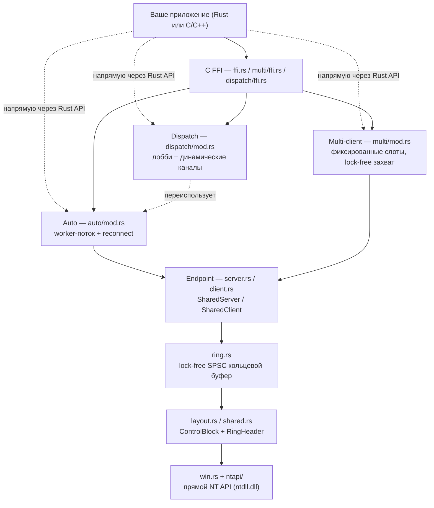
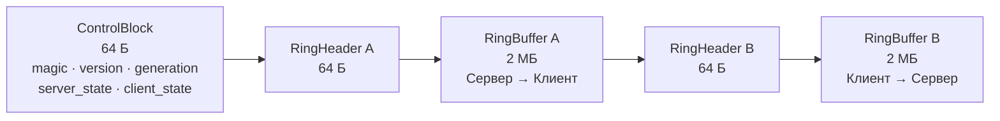
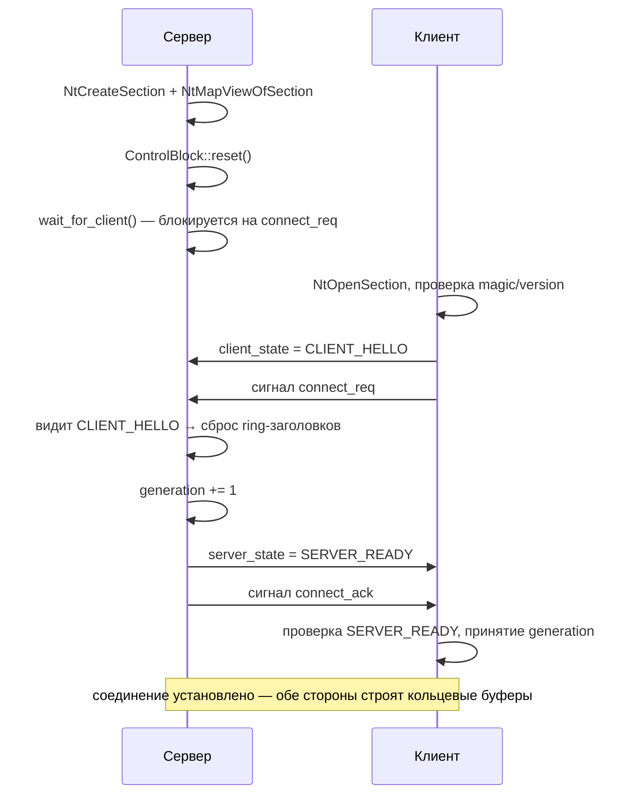
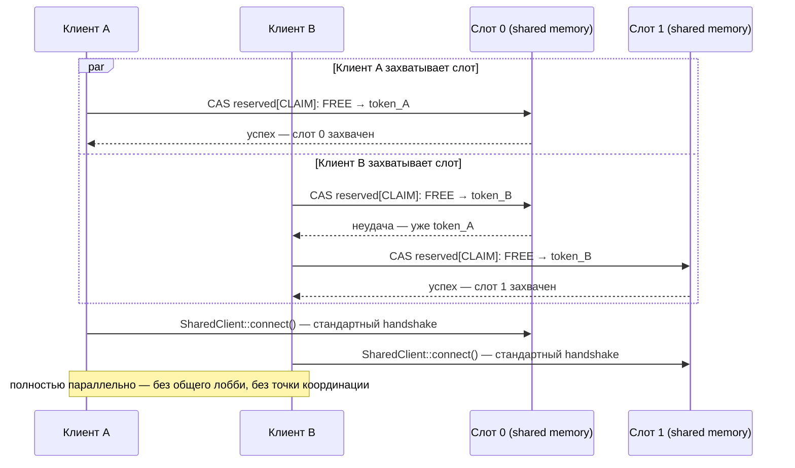

<div align="center">

# xShm

**Высокопроизводительный межпроцессный IPC через shared memory для Windows**

Двунаправленный обмен сообщениями через lock-free SPSC кольцевые буферы, поверх прямых вызовов NT API. Ядро на Rust, полноценный C/C++ FFI.

<p>
  
  
  
  
  
</p>

<p>
  <a href="README.md"></a>
  <a href="README.ru.md"></a>
</p>

</div>

---

## 🆕 Что нового в v0.6.0

- ✅ **Dispatch-режим** — пятый режим (`DispatchServer`/`DispatchClient`): одно лобби + динамический канал на каждого клиента, без фиксированного верхнего предела числа клиентов
- ✅ **Редизайн Multi-client** — центральный lobby-сегмент убран. Клиенты теперь конкурентно захватывают свободный слот через lock-free CAS на памяти самого слота — полностью параллельные подключения, без общей точки конкуренции
- ✅ **Хардненинг** — защита от torn-read при переполнении кольца, обнаружение мёртвых/брошенных слотов (liveness-проверка процесса-владельца), синхронный `stop()` (больше никакого use-after-free через FFI при остановке), ограниченные send-очереди повсюду
- ✅ **Чистка API** (breaking, pre-1.0) — убраны мёртвые поля, унифицированы имена между режимами (`poll_timeout`, `channel_name`), убран автогенерируемый префикс имени объекта — вызывающая сторона теперь полностью владеет видимым именем NT-объекта
- ✅ **Не требует прав администратора** — именованные объекты по умолчанию session-scoped; повышенные привилегии нужны только при явном использовании `Global\`

## Возможности

- Межпроцессный канал с двумя кольцевыми буферами (сервер→клиент и клиент→сервер), по 2 МБ каждый
- Lock-free конкурентный доступ: независимые чтение/запись, автоматический overwrite при переполнении, защита от torn-read при переполнении (seqlock-копирование)
- Синхронизация на событиях NT API для уведомлений о данных/месте/подключении
- Гарантия чистого старта: буферы сбрасываются при каждом новом подключении с отслеживанием generation
- Готовые к использованию C-заголовки (`xshm.h`, `xshm_server.h`, `xshm_client.h`) со вспомогательными функциями
- **Auto-режим**: фоновая обработка сообщений с callback'ами (`on_message`/`on_overflow`), автоматический reconnect
- **Multi-client режим**: один сервер обслуживает до `MAX_MULTI_CLIENTS` (31) клиентов через lock-free конкурентный захват слота
- **Dispatch-режим**: одно лобби + динамический канал на клиента, вообще без фиксированного числа слотов
- **Прямой NT API**: статическая линковка с ntdll.dll, без внешних зависимостей
- **Статический CRT**: TLS и CRT линкуются статически, без зависимости от runtime DLL

## Архитектура



## Layout Shared Memory

Каждый канал — один Named (или anonymous) Section, замапленный в адресное пространство обоих процессов:



Итого: ~4 МБ + заголовки, вычисляется функцией `shared_mapping_size()`.

## Как устанавливается соединение



## Выбор режима

| | Single-client | Auto | Multi-client | Dispatch |
|---|:---:|:---:|:---:|:---:|
| Клиентов на сервер | 1 | 1 | до 31 (фикс. слоты) | не ограничено |
| Потоки | нет — управляется вызывающим | фоновый worker | фоновый worker на слот | worker лобби + worker на клиента |
| Reconnect | вручную | автоматически | автоматически (re-claim) | автоматически |
| Стоимость подключения | 1 handshake | 1 handshake | 1 CAS + 1 handshake | 1 round-trip к лобби + 1 handshake |
| Когда использовать | простейший парный IPC, интеграция с драйвером | один пир, нужна устойчивость | известный/ограниченный парк клиентов | размер парка заранее неизвестен |

## Требования

- Windows 10/11
- Rust 1.82+ (stable) — кодовая база использует синтаксис атрибутов `#[unsafe(...)]`; разрабатывается и тестируется на 1.96
- Тулчейн MSVC или MinGW
- **Права администратора НЕ требуются** — именованные kernel-объекты session-scoped (префикс `Local\` → `\Sessions\<SessionId>\BaseNamedObjects\`). Повышенные права нужны только при явном использовании префикса `Global\`

## Зависимости

**Минимум зависимостей** — только `thiserror` для обработки ошибок:

```toml
[dependencies]
thiserror = "2"
```

Вызовы NT API делаются напрямую через статическую линковку с `ntdll.dll`:
- Без зависимости от SSN
- Без `GetProcAddress` в рантайме
- Без TLS (Thread Local Storage)

## Сборка

```bash
# Запуск тестов
cargo test -- --test-threads=1   # последовательно: тесты делят пространство имён объектов

# Сборка статических библиотек
cargo build --release                                        # x64 MSVC (по умолчанию)
cargo build --release --target i686-pc-windows-msvc          # x86 MSVC
cargo build --release --target x86_64-pc-windows-gnu         # x64 MinGW
```

Выходные файлы:

| Таргет | Debug | Release |
|--------|-------|---------|
| MSVC x64 | `target/debug/xshm.lib` | `target/release/xshm.lib` |
| MSVC x86 | `target/i686-pc-windows-msvc/debug/xshm.lib` | `target/i686-pc-windows-msvc/release/xshm.lib` |
| MinGW x64 | `target/x86_64-pc-windows-gnu/debug/libxshm.a` | `target/x86_64-pc-windows-gnu/release/libxshm.a` |

Заголовки генерируются автоматически через `cbindgen` во время сборки.

## Использование (Rust)

```rust
use std::thread;
use std::time::Duration;
use xshm::{SharedClient, SharedServer};

fn main() -> xshm::Result<()> {
    let name = "ExampleChannel";

    let server_thread = thread::spawn({
        let name = name.to_owned();
        move || -> xshm::Result<()> {
            let mut server = SharedServer::start(&name)?;
            server.wait_for_client(Some(Duration::from_secs(5)))?;
            server.send_to_client(b"ping")?;
            let mut buffer = Vec::new();
            let len = server.receive_from_client(&mut buffer)?;
            println!("client -> server: {:?}", &buffer[..len]);
            Ok(())
        }
    });

    thread::sleep(Duration::from_millis(50));

    let client = SharedClient::connect(name, Duration::from_secs(5))?;
    let mut buffer = Vec::new();
    let len = client.receive_from_server(&mut buffer)?;
    println!("server -> client: {:?}", &buffer[..len]);
    client.send_to_server(b"pong")?;

    server_thread.join().unwrap()?;
    Ok(())
}
```

### Auto-режим (Rust)

```rust
use std::sync::Arc;
use xshm::{AutoClient, AutoHandler, AutoOptions, AutoServer, ChannelKind, Result};

struct Logger;

impl AutoHandler for Logger {
    fn on_message(&self, dir: ChannelKind, payload: &[u8]) {
        println!("[{:?}] {}", dir, String::from_utf8_lossy(payload));
    }
}

fn main() -> Result<()> {
    let handler = Arc::new(Logger);
    let server = AutoServer::start("AutoChannel", handler.clone(), AutoOptions::default())?;
    let client = AutoClient::connect("AutoChannel", handler, AutoOptions::default())?;

    client.send(b"hello")?;
    server.send(b"world")?;

    std::thread::sleep(std::time::Duration::from_millis(100));
    Ok(())
}
```

### Multi-client режим (Rust)

Фиксированный пул слотов (по умолчанию 20, жёсткий предел 31). Клиенты
конкурентно захватывают свободный слот через lock-free CAS — без
центрального лобби, без раунда согласования:



```rust
use std::sync::Arc;
use xshm::multi::{MultiServer, MultiClient, MultiHandler, MultiClientHandler, MultiOptions, MultiClientOptions};
use xshm::Result;

struct ServerHandler;

impl MultiHandler for ServerHandler {
    fn on_client_connect(&self, client_id: u32) {
        println!("Client {} connected", client_id);
    }
    fn on_client_disconnect(&self, client_id: u32) {
        println!("Client {} disconnected", client_id);
    }
    fn on_message(&self, client_id: u32, data: &[u8]) {
        println!("Message from client {}: {:?}", client_id, data);
    }
}

struct ClientHandler;

impl MultiClientHandler for ClientHandler {
    fn on_connect(&self, slot_id: u32) {
        println!("Claimed slot {}", slot_id);
    }
    fn on_disconnect(&self) {
        println!("Disconnected");
    }
    fn on_message(&self, data: &[u8]) {
        println!("Received: {:?}", data);
    }
}

fn main() -> Result<()> {
    // Запуск multi-client сервера (по умолчанию 20 слотов)
    let server = MultiServer::start("MyService", Arc::new(ServerHandler), MultiOptions::default())?;

    // Каждый клиент сам захватывает свободный слот (base name общий для всех)
    let client1 = MultiClient::connect("MyService", Arc::new(ClientHandler), MultiClientOptions::default())?;
    let client2 = MultiClient::connect("MyService", Arc::new(ClientHandler), MultiClientOptions::default())?;
    let client3 = MultiClient::connect("MyService", Arc::new(ClientHandler), MultiClientOptions::default())?;

    println!("Client 1 slot: {}", client1.slot_id());
    println!("Client 2 slot: {}", client2.slot_id());
    println!("Client 3 slot: {}", client3.slot_id());

    // Отправка конкретному клиенту по slot_id
    server.send_to(0, b"Hello client 0")?;

    // Broadcast всем подключённым
    server.broadcast(b"Hello everyone")?;

    // Клиент отправляет серверу
    client1.send(b"Hello server")?;

    std::thread::sleep(std::time::Duration::from_millis(100));
    Ok(())
}
```

### Dispatch-режим (Rust)

Одно лобби + динамический канал на базе `AutoServer` для каждого клиента.
В отличие от Multi-client, здесь нет фиксированного числа слотов — выбирайте
этот режим, когда число одновременных клиентов заранее не известно.

```rust
use std::sync::Arc;
use xshm::{
    ClientRegistration, DispatchClient, DispatchClientHandler, DispatchClientOptions,
    DispatchHandler, DispatchOptions, DispatchServer, Result,
};

struct ServerHandler;

impl DispatchHandler for ServerHandler {
    fn on_client_connect(&self, client_id: u32, info: &ClientRegistration) {
        println!("Client {} connected (pid {}, {})", client_id, info.pid, info.name);
    }
    fn on_client_disconnect(&self, client_id: u32) {
        println!("Client {} disconnected", client_id);
    }
    fn on_message(&self, client_id: u32, data: &[u8]) {
        println!("From {}: {:?}", client_id, data);
    }
}

struct ClientHandler;

impl DispatchClientHandler for ClientHandler {
    fn on_connect(&self, client_id: u32, channel_name: &str) {
        println!("Registered as client {} on channel {}", client_id, channel_name);
    }
    fn on_disconnect(&self) {
        println!("Disconnected");
    }
    fn on_message(&self, data: &[u8]) {
        println!("Received: {:?}", data);
    }
}

fn main() -> Result<()> {
    let server = DispatchServer::start("MyService", Arc::new(ServerHandler), DispatchOptions::default())?;

    let registration = ClientRegistration {
        pid: std::process::id(),
        revision: 1,
        name: "my_app".to_string(),
    };
    let client = DispatchClient::connect(
        "MyService",
        registration,
        Arc::new(ClientHandler),
        DispatchClientOptions::default(),
    )?;

    client.send(b"hello")?;
    server.broadcast(b"hello everyone")?;

    std::thread::sleep(std::time::Duration::from_millis(100));
    Ok(())
}
```

## Интеграция с C/C++

### Заголовки

```c
#include "xshm.h"          // Основной заголовок (включает все API)
#include "xshm_server.h"   // Серверная сторона (опционально, уже включена в xshm.h)
#include "xshm_client.h"   // Клиентская сторона (опционально, уже включена в xshm.h)
```

Event handles для интеграции с kernel-драйвером описаны отдельно в разделе
[Event Handles для kernel-драйверов](#event-handles-для-kernel-драйверов) ниже.

### Линковка

- MSVC: `xshm.lib` + `ntdll.lib`
- MinGW: `libxshm.a` + `-lntdll`

### Пример сервера (C)

```c
#include "xshm_server.h"
#include <stdio.h>

int main(void) {
    shm_endpoint_config_t cfg = xshm_server_config("MyShmChannel");
    shm_callbacks_t callbacks = xshm_server_callbacks_default();

    ServerHandle* server = shm_server_start(&cfg, &callbacks);
    if (!server) return 1;

    if (shm_server_wait_for_client(server, 5000) != SHM_SUCCESS) {
        shm_server_stop(server);
        return 1;
    }

    const char msg[] = "Hello client";
    shm_server_send(server, msg, sizeof msg);

    uint8_t buffer[1024];
    uint32_t len = sizeof buffer;
    if (shm_server_receive(server, buffer, &len) == SHM_SUCCESS) {
        printf("received %u bytes\n", len);
    }

    shm_server_stop(server);
    return 0;
}
```

### Пример клиента (C)

```c
#include "xshm_client.h"
#include <stdio.h>

int main(void) {
    shm_endpoint_config_t cfg = xshm_client_config("MyShmChannel");
    shm_callbacks_t callbacks = xshm_client_callbacks_default();

    ClientHandle* client = shm_client_connect(&cfg, &callbacks, 5000);
    if (!client) return 1;

    uint8_t buffer[1024];
    uint32_t len = sizeof buffer;
    if (shm_client_receive(client, buffer, &len) == SHM_SUCCESS) {
        printf("server says: %.*s\n", (int)len, buffer);
    }

    const char reply[] = "Hello server";
    shm_client_send(client, reply, sizeof reply);

    shm_client_disconnect(client);
    return 0;
}
```

### Multi-client сервер (C)

```c
#include "xshm_server.h"
#include <stdio.h>

void on_connect(uint32_t client_id, void* user_data) {
    printf("Client %u connected\n", client_id);
}

void on_disconnect(uint32_t client_id, void* user_data) {
    printf("Client %u disconnected\n", client_id);
}

void on_message(uint32_t client_id, const void* data, uint32_t size, void* user_data) {
    printf("Message from client %u: %.*s\n", client_id, (int)size, (const char*)data);
}

int main(void) {
    shm_multi_callbacks_t callbacks = shm_multi_callbacks_default();
    callbacks.on_client_connect = on_connect;
    callbacks.on_client_disconnect = on_disconnect;
    callbacks.on_message = on_message;

    shm_multi_options_t options = shm_multi_options_default();
    options.max_clients = 20;  // по умолчанию 20, жёсткий предел 31

    MultiServerHandle* server = shm_multi_server_start("MyService", &callbacks, &options);
    if (!server) return 1;

    // Клиенты подключаются к "MyService" и конкурентно захватывают
    // свободный слот (без round-trip к лобби) — см. shm_multi_client_connect в xshm.h

    // Отправка конкретному клиенту
    shm_multi_server_send_to(server, 0, "Hello client 0", 14);

    // Broadcast всем
    uint32_t sent = 0;
    shm_multi_server_broadcast(server, "Hello all", 9, &sent);
    printf("Broadcast sent to %u clients\n", sent);

    // Количество подключённых клиентов
    printf("Connected: %u clients\n", shm_multi_server_client_count(server));

    shm_multi_server_stop(server);
    return 0;
}
```

### Dispatch-сервер (C)

Одно лобби, без фиксированного числа слотов — динамический канал создаётся
на каждого клиента при регистрации.

```c
#include "xshm_server.h"
#include <stdio.h>

void on_client_connect(uint32_t client_id, uint32_t pid, uint16_t revision,
                        const char* name, void* user_data) {
    printf("Client %u connected (pid %u, %s)\n", client_id, pid, name);
}

void on_message(uint32_t client_id, const void* data, uint32_t size, void* user_data) {
    printf("From %u: %.*s\n", client_id, (int)size, (const char*)data);
}

int main(void) {
    shm_dispatch_callbacks_t callbacks = xshm_dispatch_callbacks_default();
    callbacks.on_client_connect = on_client_connect;
    callbacks.on_message = on_message;

    shm_dispatch_options_t options = shm_dispatch_options_default();

    DispatchServerHandle* server = shm_dispatch_server_start("MyService", &callbacks, &options);
    if (!server) return 1;

    // Клиенты регистрируются через shm_dispatch_client_connect() — сервер
    // выдаёт динамически сгенерированное имя канала на каждого, без лимита слотов

    uint32_t sent = 0;
    shm_dispatch_server_broadcast(server, "hello everyone", 14, &sent);

    shm_dispatch_server_stop(server);
    return 0;
}
```

## Константы

| Константа | Значение | Описание |
|-----------|----------|----------|
| `RING_CAPACITY` | 2 МБ | Размер каждого кольцевого буфера |
| `MAX_MESSAGES` | 500 | Максимум сообщений в очереди |
| `MAX_MESSAGE_SIZE` | 65535 | Максимальный размер сообщения (байт) |
| `MIN_MESSAGE_SIZE` | 2 | Минимальный размер сообщения (байт) |
| `DEFAULT_MAX_CLIENTS` | 20 | Число слотов `MultiServer` по умолчанию |
| `MAX_MULTI_CLIENTS` | 31 | Жёсткий предел `MultiServer` (лимит `NtWaitForMultipleObjects`) |

## Event Handles для kernel-драйверов

Любой именованный сервер может отдать свои raw NT event handles, чтобы
kernel-драйвер мог ждать на них напрямую (event-driven, без polling) вместо
обращения через FFI/Rust API на каждое уведомление.

**C API**:
```c
#include "xshm.h"

ServerHandle* server = shm_server_start(&config, NULL);

shm_event_handles_t event_handles = {0};
if (shm_server_get_event_handles(server, &event_handles)) {
    // event_handles.s2c_data - событие данных Сервер→Клиент (пользователь сигналит драйверу)
    // event_handles.c2s_data - событие данных Клиент→Сервер (драйвер сигналит пользователю)

    // Пример: передача в kernel-драйвер через IOCTL
    request.ShmDataEventHandle = (HANDLE)event_handles.s2c_data;
    request.ShmSpaceEventHandle = (HANDLE)event_handles.c2s_data;
} else {
    // Anonymous-сервер - событий нет, используйте polling
}
```

**Rust API**:
```rust
use xshm::{SharedServer, EventHandles};

let server = SharedServer::start("MyChannel")?;
if let Some(handles) = server.get_event_handles() {
    // handles.s2c_data - событие данных Сервер→Клиент
    // handles.c2s_data - событие данных Клиент→Сервер
}
```

**Примечание**: для anonymous-серверов (`SharedServer::start_anonymous()`)
возвращается `false`/`None` — именованные события не создаются. В этом
случае используйте polling.

## Ограничения

- **SPSC**: строго один producer и один consumer на канал
- **Overwrite при переполнении**: новые сообщения вытесняют старые, когда очередь заполнена
- **Только Windows**: использует прямые вызовы NT API, полагается на x86/x86_64 TSO memory ordering (не переносимо на ARM/RISC-V без переработки)
- **Размер сообщения**: от 2 до 65535 байт
- **Anonymous-серверы**: event handles недоступны (только режим polling)
- **Число слотов Multi-client**: жёсткий предел 31 одновременный клиент (лимит `NtWaitForMultipleObjects`) — используйте Dispatch-режим, если нужно больше

## Структура проекта

```
xshm/
├── .cargo/
│   └── config.toml     # Конфигурация статической линковки CRT
├── src/
│   ├── lib.rs          # Корневой модуль, публичные реэкспорты
│   ├── ntapi/          # Слой прямого NT API (без внешних зависимостей)
│   │   ├── mod.rs      # Реэкспорт модуля
│   │   ├── types.rs    # NT-типы (HANDLE, NTSTATUS, OBJECT_ATTRIBUTES...)
│   │   ├── funcs.rs    # Объявления NT-функций (#[link(name = "ntdll")])
│   │   └── helpers.rs  # UNICODE_STRING, NtName, конвертация путей
│   ├── win.rs          # Высокоуровневые обёртки (EventHandle, Mapping, is_process_alive)
│   ├── server.rs       # Endpoint SharedServer
│   ├── client.rs       # Endpoint SharedClient
│   ├── ring.rs          # Lock-free SPSC кольцевой буфер
│   ├── layout.rs       # Структуры shared memory
│   ├── events.rs       # Синхронизация на событиях
│   ├── ffi.rs          # C-совместимый FFI-слой (single-client + auto)
│   ├── error.rs        # Типы ошибок
│   ├── constants.rs    # Константы протокола
│   ├── naming.rs       # Именование kernel-объектов
│   ├── shared.rs       # SharedView для mapped-памяти
│   ├── auto/
│   │   └── mod.rs      # Auto-режим с фоновыми worker'ами
│   ├── multi/
│   │   ├── mod.rs      # MultiServer/MultiClient — фикс. слоты, конкурентный захват
│   │   └── ffi.rs      # C API для Multi-client
│   └── dispatch/
│       ├── mod.rs      # DispatchServer/DispatchClient — лобби + динамические каналы
│       ├── ffi.rs      # C API для Dispatch
│       └── protocol.rs # Бинарный протокол регистрации в лобби
├── include/
│   ├── xshm.h          # Основной FFI-заголовок (автогенерация через cbindgen)
│   ├── xshm_server.h   # Серверные хелперы (single/multi/dispatch)
│   └── xshm_client.h   # Клиентские хелперы (single/multi/dispatch)
├── tests/
│   ├── stress.rs       # Стресс-тесты
│   ├── ordering.rs     # Тесты memory ordering
│   └── multi.rs        # Тесты Multi-client
├── Cargo.toml
├── build.rs            # Интеграция cbindgen
└── cbindgen.toml
```

## Лицензия

MIT
