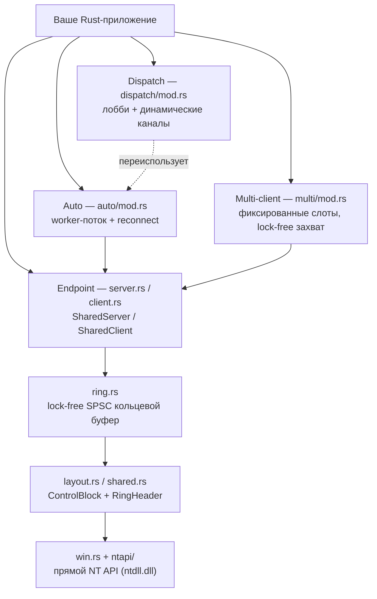
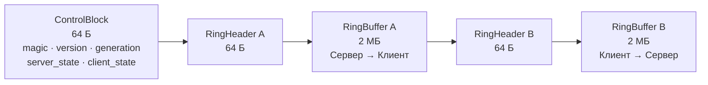
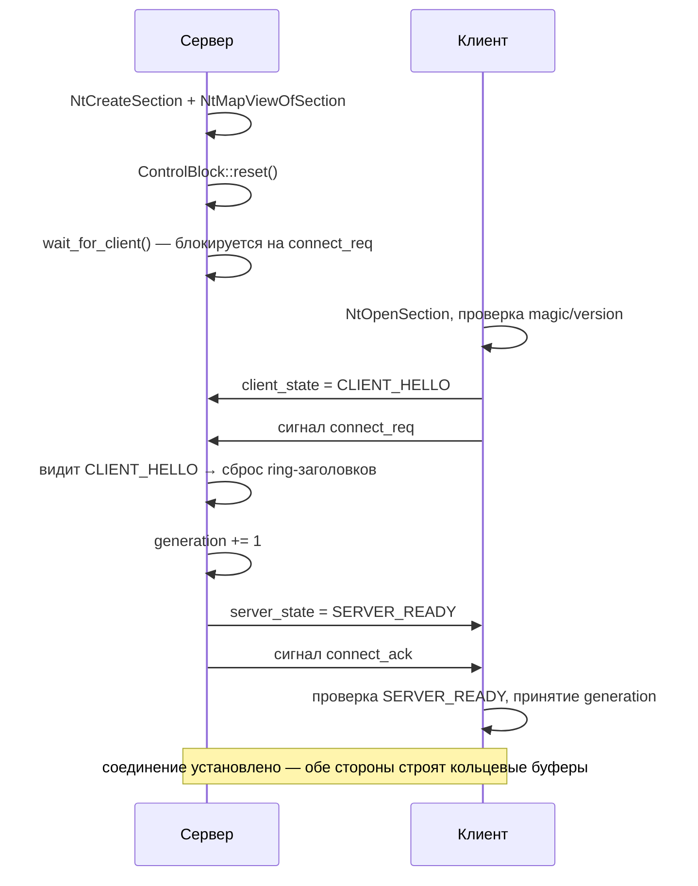
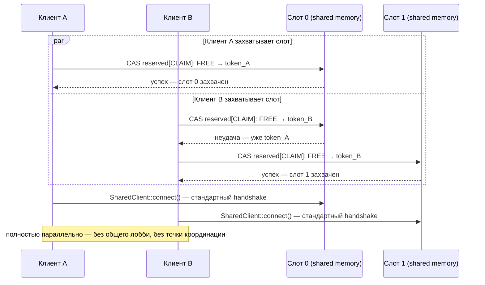

<div align="center">

# xShm

**Высокопроизводительный межпроцессный IPC через shared memory для Windows**

Двунаправленный обмен сообщениями через lock-free SPSC кольцевые буферы, поверх прямых вызовов NT API. Чистый Rust-крейт — без C/C++ FFI.

<p>
  
  
  
  
  
</p>

<p>
  <a href="README.md"></a>
  <a href="README.ru.md"></a>
</p>

</div>

---

## 🆕 Что нового в v0.9.0

- ✅ **Auto/Dispatch целиком по событиям** (breaking: `poll_timeout` теперь
  `Option<Duration>`, по умолчанию `None`) — каждый worker, поток лобби и поток
  ожидания подключения спит в ядре до события: данные, место, отключение,
  смерть пира, новая команда (`send`/`try_send`/`stop` будят worker безымянным
  событием) или остановка. Ноль пробуждений в простое; отправка больше не ждёт
  следующего тика опроса (50 мс). `Some(t)` — необязательный страховочный
  таймаут.
- ✅ **Multi-client по событиям** (breaking: `MultiOptions`/`MultiClientOptions::poll_timeout`
  теперь `Option<Duration>`, по умолчанию `None`; новое `MultiClientOptions::retry_delay`) —
  тика 50 мс больше нет. Worker-ы сервера (по одному на 21 слот) спят на `CONNECT_REQ` /
  `DISCONNECT` / `DATA` / handle процесса клиента / безымянном `wake` и просыпаются по
  таймауту только к ближайшему *дедлайну* (протухший захват слота, разовая проверка
  брошенного рукопожатия). Смерть клиента — по handle процесса
  (`on_client_disconnect_reason(PeerDied)`); клиент, не нашедший свободного слота,
  «толкает» сервер, и захват упавшего клиента снимается ровно на дедлайне. Новые
  методы по умолчанию `on_client_disconnect_reason` / `on_disconnect_reason`,
  `MultiServer::is_client_alive`. Тесты доказывают 0 пробуждений за секунду простоя.
- ✅ **`wait_for_space` без срезов** — одно ожидание в ядре на весь таймаут по
  `[SPACE, DISCONNECT, процесс пира]`; штатное отключение пира — `Err(NotConnected)`,
  а не ожидание до таймаута.
- ✅ **Лобби Dispatch сериализовано** — клиент держит именованный мьютекс `<лобби>_lock`
  всё рукопожатие с лобби (два одновременных клиента могли прочитать чужой ответ); имя
  канала наследует namespace лобби (`Global\<hex>`) — межсессионный Dispatch работает;
  `Beacon::open` отвергает подменённое автосбросное событие с тем же именем.
- ✅ **`Beacon` — событийное обнаружение сервера** — именованное
  событие-уведомление с ручным сбросом `<имя>_beacon`: сервер взводит его
  (`raise`) сразу после создания лобби и сбрасывает (`lower`) до остановки;
  клиенты спят в `wait()` / `wait_any()` и просыпаются все сразу — никаких
  попыток подключения, пока сервера нет. `open` создаёт или открывает (порядок
  запуска любой), `is_raised()` — проверка без ожидания. `Beacon::unnamed()` —
  безымянное событие того же вида (например, сигнал остановки рядом с маяком
  в `wait_any`; по имени его не открыть и не занять). `ProcessExit` держит
  handle процесса и срабатывает при его завершении;
  `xshm::wait_any(&[&dyn Waitable], timeout)` ждёт маяки и завершения
  процессов вместе. См. [Обнаружение сервера](#обнаружение-сервера).
- ✅ **Dispatch: надёжность** — `DispatchServer::start` создаёт лобби
  синхронно (занятое имя — ошибка, а не молчаливые повторы в фоне); клиент
  объявляется (`on_client_connect`) в worker-е своего канала **до** первого
  `on_message` (ранние сообщения раньше приходили от неизвестного клиента и
  терялись); сообщения, принятые до `disconnect_client`/`stop`, дописываются в
  кольцо, и пир дочитывает их до своего `on_disconnect` (прощальное сообщение
  с причиной теперь доходит); `stop()` будит все потоки событием, а не ждёт
  тика опроса или `channel_connect_timeout`; `DispatchClient::lobby_exists(name)`.
- ✅ **События места для отправителей** — `DispatchClientHandler::on_space_available()`
  и `DispatchHandler::on_space_available(client_id)` (по умолчанию ничего):
  отправитель без потерь, получивший `QueueFull`, спит до освобождения места
  пиром, а не в цикле со сном. Перед колбэком worker дописывает очередь в
  освободившееся место.
- 🐛 **Ревизия 2 (25.09.2026)** — клиент, отключённый сразу после
  рукопожатия (например, отказ из `on_client_connect`), получает прощание и
  `on_disconnect`: рукопожатие засчитывается по смене `generation`, даже если
  сервер уже `IDLE` (раньше клиент откатывался и вечно переподключался к
  исчезнувшему каналу). Рукопожатие фиксируется CAS-ами с обеих сторон
  (нет устаревшего `S2C_CONNECT` для следующего клиента); выделенный канал
  Dispatch не переподключается и после неудачного первого подключения;
  Multi `disconnect_client` держит claim слота, пока клиент не проснётся
  (раньше на одном кольце могли оказаться два клиента); `stop()`/Drop не
  ждут таймаута рукопожатия; `MultiServer::stop()` сигналит клиентам сразу;
  `DispatchServer::stop()` из колбэка обработчика больше не блокируется.
  Пир-видимые правила R15–R17 — [`INTEROP.md`](INTEROP.md).
- 🐛 Имена тестов маяка не были уникальны (`Instant::now().elapsed()` ≈ 0).

> **Нативные (C/C++) пиры:** раскладка памяти и объекты ядра каналов не изменились,
> но 0.9 больше не «лечит» пропущенные сигналы опросом раз в 50 мс. Что обязана
> сигналить совместимая реализация, новый объект `<имя>_beacon` и гарантии порядка
> Dispatch — в [INTEROP.md](INTEROP.md).

- ✅ **Хук старта рабочих потоков** — `xshm::set_thread_start_hook(Some(f))` на потоке:
  каждый рабочий поток, который библиотека создаст из него (worker-ы Auto/Dispatch/Multi,
  канал клиента `DispatchServer`, ожидание канала, отложенный `Drop`), первым делом зовёт
  `f()`; потоки, порождённые рабочими, наследуют хук. xshm-объекты других потоков не
  затрагиваются. `prof-shm` так делает свои транспортные потоки внутренними для учёта
  памяти профайлера. Только Rust API: на проводе ничего не меняется.

## Ранее в v0.8.0


- ✅ **Запись без потерь** — `try_send_to_client` / `try_send_to_server` / `try_send` / `try_send_to` никогда не затирают непрочитанное (`Err(QueueFull)` — кольцо не тронуто); `free_space()` — консервативная оценка места для писателя; `wait_for_space()` ждёт события `SPACE`. Раскладка совместима с 0.7.0 (`SHARED_VERSION` прежний).
- ✅ **Надёжная детекция смерти пира** — в handshake стороны обмениваются PID, и каждая держит открытый handle процесса другой; убитый/упавший пир замечается за ~1–5 мс (см. [Живость пира](#живость-пира)). Новый `DisconnectReason` (`Graceful` / `PeerDied` / `Local` / `Error`) через колбэки-методы по умолчанию `on_disconnect_reason` / `on_client_disconnect_reason`, аксессоры `is_peer_alive()` / `peer_pid()`, `ShmError::PeerDied` из `wait_for_space` / `poll_*`. Совместимо по wire-формату с пирами 0.7.0 / раннего 0.8.0 (за ними просто нет наблюдения).
- ✅ Константы кольца (`RING_CAPACITY`, `MAX_MESSAGES`, `MAX_MESSAGE_SIZE`, …) экспортируются из корня крейта.
- 🐛 Auto: `send` недопустимой длины больше не блокирует очередь навсегда — сообщение выбрасывается с `on_error`.

## Ранее в v0.7.0

- ✅ **Чистый Rust-крейт** (breaking) — весь слой C/C++ FFI удалён: `ffi.rs`, `multi/ffi.rs`, `dispatch/ffi.rs`, сборочный шаг `cbindgen`, сгенерированные заголовки `include/*.h` и crate-type `staticlib`. Крейт собирается только как `rlib` и потребляется из Rust; для нативных потребителей пишется отдельный синхронный проект на C23.
- ✅ **Ноль build-зависимостей** — `build.rs` теперь делает единственную вещь: `cargo:rustc-link-lib=ntdll`; `thiserror` остаётся единственной runtime-зависимостью
- ✅ **Edition 2024 / современный Rust** — `unsafe extern` для NT-импортов, if-let цепочки, strict provenance (`.addr()` / `without_provenance_mut`) вместо `as`-кастов между целыми и указателями, `MaybeUninit` + `spare_capacity_mut` вместо `set_len` до записи, политика линтов в манифесте с `undocumented_unsafe_blocks = "deny"`, `Debug` и `#[must_use]` по публичному API
- ✅ **Полный аудит** — `Global\` в имени канала наконец работает (межсессионный IPC был сломан), `Mapping::open` отвергает секции недостаточного размера, `MultiClient::is_connected()`/`DispatchClient::is_connected()` перестали врать после остановки, переполнение send-очереди сообщается через `on_overflow`, из worker-потоков убраны все `expect()`-паники

## Ранее в v0.6.0

- ✅ **Dispatch-режим** — пятый режим (`DispatchServer`/`DispatchClient`): одно лобби + динамический канал на каждого клиента, без фиксированного верхнего предела числа клиентов
- ✅ **Редизайн Multi-client** — центральный lobby-сегмент убран. Клиенты теперь конкурентно захватывают свободный слот через lock-free CAS на памяти самого слота — полностью параллельные подключения, без общей точки конкуренции
- ✅ **Хардненинг** — защита от torn-read при переполнении кольца, обнаружение мёртвых/брошенных слотов (liveness-проверка процесса-владельца), синхронный `stop()` (после возврата ни один callback уже не вызывается), ограниченные send-очереди повсюду
- ✅ **Чистка API** (breaking, pre-1.0) — убраны мёртвые поля, унифицированы имена между режимами (`poll_timeout`, `channel_name`), убран автогенерируемый префикс имени объекта — вызывающая сторона теперь полностью владеет видимым именем NT-объекта
- ✅ **Не требует прав администратора** — именованные объекты по умолчанию session-scoped; повышенные привилегии нужны только при явном использовании `Global\`

## Возможности

- Межпроцессный канал с двумя кольцевыми буферами (сервер→клиент и клиент→сервер), по 2 МБ каждый
- Lock-free конкурентный доступ: независимые чтение/запись, автоматический overwrite при переполнении, защита от torn-read при переполнении (seqlock-копирование)
- Синхронизация на событиях NT API для уведомлений о данных/месте/подключении
- Гарантия чистого старта: буферы сбрасываются при каждом новом подключении с отслеживанием generation
- Трейты-обработчики вместо callback-структур: `AutoHandler`, `MultiHandler`, `MultiClientHandler`, `DispatchHandler`, `DispatchClientHandler`
- **Auto-режим**: фоновая обработка сообщений с callback'ами (`on_message`/`on_overflow`), автоматический reconnect
- **Multi-client режим**: один сервер обслуживает до `MAX_MULTI_CLIENTS` (31) клиентов через lock-free конкурентный захват слота
- **Dispatch-режим**: одно лобби + динамический канал на клиента, вообще без фиксированного числа слотов
- **Прямой NT API**: статическая линковка с ntdll.dll, без внешних зависимостей
- **Статический CRT**: TLS и CRT линкуются статически, без зависимости от runtime DLL

## Архитектура


```mermaid
flowchart TD
    App["Ваше Rust-приложение"]
    App --> Auto["Auto — auto/mod.rs<br/>worker-поток + reconnect"]
    App --> Multi["Multi-client — multi/mod.rs<br/>фиксированные слоты, lock-free захват"]
    App --> Dispatch["Dispatch — dispatch/mod.rs<br/>лобби + динамические каналы"]
    App --> Endpoint

    Dispatch -. переиспользует .-> Auto

    Auto --> Endpoint["Endpoint — server.rs / client.rs<br/>SharedServer / SharedClient"]
    Multi --> Endpoint

    Endpoint --> Ring["ring.rs<br/>lock-free SPSC кольцевой буфер"]
    Ring --> Layout["layout.rs / shared.rs<br/>ControlBlock + RingHeader"]
    Layout --> Platform["win.rs + ntapi/<br/>прямой NT API (ntdll.dll)"]
```

## Layout Shared Memory

Каждый канал — один Named (или anonymous) Section, замапленный в адресное пространство обоих процессов:


```mermaid
flowchart LR
    CB["ControlBlock<br/>64 Б<br/>magic · version · generation<br/>server_state · client_state"]
    RHA["RingHeader A<br/>64 Б"]
    RBA["RingBuffer A<br/>2 МБ<br/>Сервер → Клиент"]
    RHB["RingHeader B<br/>64 Б"]
    RBB["RingBuffer B<br/>2 МБ<br/>Клиент → Сервер"]
    CB --> RHA --> RBA --> RHB --> RBB
```

Итого: ~4 МБ + заголовки, вычисляется функцией `shared_mapping_size()`.

## Как устанавливается соединение


```mermaid
sequenceDiagram
    participant S as Сервер
    participant C as Клиент

    S->>S: NtCreateSection + NtMapViewOfSection
    S->>S: ControlBlock::reset()
    S->>S: wait_for_client() — блокируется на connect_req

    C->>C: NtOpenSection, проверка magic/version
    C->>S: client_state = CLIENT_HELLO
    C->>S: сигнал connect_req

    S->>S: видит CLIENT_HELLO → сброс ring-заголовков
    S->>S: generation += 1
    S->>C: server_state = SERVER_READY
    S->>C: сигнал connect_ack

    C->>C: проверка SERVER_READY, принятие generation
    Note over S,C: соединение установлено — обе стороны строят кольцевые буферы
```

## Выбор режима

| | Single-client | Auto | Multi-client | Dispatch |
|---|:---:|:---:|:---:|:---:|
| Клиентов на сервер | 1 | 1 | до 31 (фикс. слоты) | не ограничено |
| Потоки | нет — управляется вызывающим | фоновый worker | фоновый worker на слот | worker лобби + worker на клиента |
| Reconnect | вручную | автоматически | автоматически (re-claim) | автоматически |
| Стоимость подключения | 1 handshake | 1 handshake | 1 CAS + 1 handshake | 1 round-trip к лобби + 1 handshake |
| Когда использовать | простейший парный IPC, интеграция с драйвером | один пир, нужна устойчивость | известный/ограниченный парк клиентов | размер парка заранее неизвестен |

## Именование каналов

Имя, переданное в конструктор, становится именем kernel-объекта как есть, а
namespace выбирается по префиксу:

| Что передали | Объект-секция | Namespace |
|--------------|---------------|-----------|
| `"Chan"` | `Local\Chan` | session-local |
| `"Local\Chan"` | `Local\Chan` | session-local (префикс не удваивается) |
| `"Global\Chan"` | `Global\Chan` | глобальный — нужен для IPC между сессиями (служба в сессии 0 ↔ процесс на десктопе) |
| `"\BaseNamedObjects\Chan"` | как есть | готовый NT-путь |

События канала всегда попадают в тот же namespace, что и секция.

## Требования

- Windows 10/11
- Rust 1.98+ (stable) — edition 2024, `rust-version = "1.98"` в манифесте
- Тулчейн MSVC (MinGW-таргеты убраны в 0.7.0 вместе с C ABI)
- **Права администратора НЕ требуются** — именованные kernel-объекты session-scoped (префикс `Local\` → `\Sessions\<SessionId>\BaseNamedObjects\`). Повышенные права нужны только при явном использовании префикса `Global\`

## Зависимости

**Минимум зависимостей** — только `thiserror` для обработки ошибок:

```toml
[dependencies]
thiserror = "2"
```

Вызовы NT API делаются напрямую через статическую линковку с `ntdll.dll`:
- Без зависимости от SSN
- Без `GetProcAddress` в рантайме
- Без TLS (Thread Local Storage)

## Сборка

Подключается как path- или git-зависимость:

```toml
[dependencies]
xshm = { path = "../xshm" }
```

```bash
cargo build --release                                   # x64 MSVC (по умолчанию)
cargo build --release --target i686-pc-windows-msvc     # x86 MSVC

# Запуск тестов
cargo test -- --test-threads=1   # последовательно: тесты делят пространство имён объектов
```

Крейт собирается только как `rlib`. `build.rs` делает ровно одно — `cargo:rustc-link-lib=ntdll`, — так что `ntdll` линкуется в итоговый бинарь потребителя.

## Использование

```rust
use std::thread;
use std::time::Duration;
use xshm::{SharedClient, SharedServer};

fn main() -> xshm::Result<()> {
    let name = "ExampleChannel";

    let server_thread = thread::spawn({
        let name = name.to_owned();
        move || -> xshm::Result<()> {
            let mut server = SharedServer::start(&name)?;
            server.wait_for_client(Some(Duration::from_secs(5)))?;
            server.send_to_client(b"ping")?;
            let mut buffer = Vec::new();
            let len = server.receive_from_client(&mut buffer)?;
            println!("client -> server: {:?}", &buffer[..len]);
            Ok(())
        }
    });

    thread::sleep(Duration::from_millis(50));

    let client = SharedClient::connect(name, Duration::from_secs(5))?;
    let mut buffer = Vec::new();
    let len = client.receive_from_server(&mut buffer)?;
    println!("server -> client: {:?}", &buffer[..len]);
    client.send_to_server(b"pong")?;

    server_thread.join().unwrap()?;
    Ok(())
}
```

### Auto-режим

```rust
use std::sync::Arc;
use xshm::{AutoClient, AutoHandler, AutoOptions, AutoServer, ChannelKind, Result};

struct Logger;

impl AutoHandler for Logger {
    fn on_message(&self, dir: ChannelKind, payload: &[u8]) {
        println!("[{:?}] {}", dir, String::from_utf8_lossy(payload));
    }
}

fn main() -> Result<()> {
    let handler = Arc::new(Logger);
    let server = AutoServer::start("AutoChannel", handler.clone(), AutoOptions::default())?;
    let client = AutoClient::connect("AutoChannel", handler, AutoOptions::default())?;

    client.send(b"hello")?;
    server.send(b"world")?;

    std::thread::sleep(std::time::Duration::from_millis(100));
    Ok(())
}
```

### Multi-client режим

Фиксированный пул слотов (по умолчанию 20, жёсткий предел 31). Клиенты
конкурентно захватывают свободный слот через lock-free CAS — без
центрального лобби, без раунда согласования:


```mermaid
sequenceDiagram
    participant A as Клиент A
    participant B as Клиент B
    participant S0 as Слот 0 (shared memory)
    participant S1 as Слот 1 (shared memory)

    par Клиент A захватывает слот
        A->>S0: CAS reserved[CLAIM]: FREE → token_A
        S0-->>A: успех — слот 0 захвачен
    and Клиент B захватывает слот
        B->>S0: CAS reserved[CLAIM]: FREE → token_B
        S0-->>B: неудача — уже token_A
        B->>S1: CAS reserved[CLAIM]: FREE → token_B
        S1-->>B: успех — слот 1 захвачен
    end

    A->>S0: SharedClient::connect() — стандартный handshake
    B->>S1: SharedClient::connect() — стандартный handshake
    Note over A,B: полностью параллельно — без общего лобби, без точки координации
```

```rust
use std::sync::Arc;
use xshm::multi::{MultiServer, MultiClient, MultiHandler, MultiClientHandler, MultiOptions, MultiClientOptions};
use xshm::Result;

struct ServerHandler;

impl MultiHandler for ServerHandler {
    fn on_client_connect(&self, client_id: u32) {
        println!("Client {} connected", client_id);
    }
    fn on_client_disconnect(&self, client_id: u32) {
        println!("Client {} disconnected", client_id);
    }
    fn on_message(&self, client_id: u32, data: &[u8]) {
        println!("Message from client {}: {:?}", client_id, data);
    }
}

struct ClientHandler;

impl MultiClientHandler for ClientHandler {
    fn on_connect(&self, slot_id: u32) {
        println!("Claimed slot {}", slot_id);
    }
    fn on_disconnect(&self) {
        println!("Disconnected");
    }
    fn on_message(&self, data: &[u8]) {
        println!("Received: {:?}", data);
    }
}

fn main() -> Result<()> {
    // Запуск multi-client сервера (по умолчанию 20 слотов)
    let server = MultiServer::start("MyService", Arc::new(ServerHandler), MultiOptions::default())?;

    // Каждый клиент сам захватывает свободный слот (base name общий для всех)
    let client1 = MultiClient::connect("MyService", Arc::new(ClientHandler), MultiClientOptions::default())?;
    let client2 = MultiClient::connect("MyService", Arc::new(ClientHandler), MultiClientOptions::default())?;
    let client3 = MultiClient::connect("MyService", Arc::new(ClientHandler), MultiClientOptions::default())?;

    println!("Client 1 slot: {}", client1.slot_id());
    println!("Client 2 slot: {}", client2.slot_id());
    println!("Client 3 slot: {}", client3.slot_id());

    // Отправка конкретному клиенту по slot_id
    server.send_to(0, b"Hello client 0")?;

    // Broadcast всем подключённым
    server.broadcast(b"Hello everyone")?;

    // Клиент отправляет серверу
    client1.send(b"Hello server")?;

    std::thread::sleep(std::time::Duration::from_millis(100));
    Ok(())
}
```

### Dispatch-режим

Одно лобби + динамический канал на базе `AutoServer` для каждого клиента.
В отличие от Multi-client, здесь нет фиксированного числа слотов — выбирайте
этот режим, когда число одновременных клиентов заранее не известно.

```rust
use std::sync::Arc;
use xshm::{
    ClientRegistration, DispatchClient, DispatchClientHandler, DispatchClientOptions,
    DispatchHandler, DispatchOptions, DispatchServer, Result,
};

struct ServerHandler;

impl DispatchHandler for ServerHandler {
    fn on_client_connect(&self, client_id: u32, info: &ClientRegistration) {
        println!("Client {} connected (pid {}, {})", client_id, info.pid, info.name);
    }
    fn on_client_disconnect(&self, client_id: u32) {
        println!("Client {} disconnected", client_id);
    }
    fn on_message(&self, client_id: u32, data: &[u8]) {
        println!("From {}: {:?}", client_id, data);
    }
}

struct ClientHandler;

impl DispatchClientHandler for ClientHandler {
    fn on_connect(&self, client_id: u32, channel_name: &str) {
        println!("Registered as client {} on channel {}", client_id, channel_name);
    }
    fn on_disconnect(&self) {
        println!("Disconnected");
    }
    fn on_message(&self, data: &[u8]) {
        println!("Received: {:?}", data);
    }
}

fn main() -> Result<()> {
    let server = DispatchServer::start("MyService", Arc::new(ServerHandler), DispatchOptions::default())?;

    let registration = ClientRegistration {
        pid: std::process::id(),
        revision: 1,
        name: "my_app".to_string(),
    };
    let client = DispatchClient::connect(
        "MyService",
        registration,
        Arc::new(ClientHandler),
        DispatchClientOptions::default(),
    )?;

    client.send(b"hello")?;
    server.broadcast(b"hello everyone")?;

    std::thread::sleep(std::time::Duration::from_millis(100));
    Ok(())
}
```

### Запись без потерь (backpressure)

По умолчанию все пути отправки при заполненном кольце вытесняют самые старые
непрочитанные сообщения. Если читатель обязан увидеть *каждое* сообщение
(например, поток профайлера), используйте варианты без перезаписи:

| Режим | Отправка без перезаписи | Свободное место |
|-------|-------------------------|-----------------|
| Single-client | `SharedServer::try_send_to_client`, `SharedClient::try_send_to_server` | `free_space()`, `wait_for_space(len, timeout)` |
| Auto | `AutoServer::try_send`, `AutoClient::try_send` | `free_space()` |
| Dispatch | `DispatchClient::try_send`, `DispatchServer::try_send_to` | `DispatchClient::free_space()`, `DispatchServer::free_space(id)` |
| Multi-client | `MultiServer::try_send_to` | `MultiServer::free_space(id)` |

Семантика:

- Сообщение либо **целиком** ложится в свободное место, либо отклоняется с
  `ShmError::QueueFull`; непрочитанные данные не трогаются никогда (`overwritten` всегда 0).
  Атомарность та же, что у обычной отправки: читатель видит сообщение целиком или не видит вовсе.
- `FreeSpace { bytes, messages }` (+ `fits(len)`, `max_payload()`), снятый на стороне писателя, --
  **нижняя граница**: если `fits(n)`, следующий `try_send*` длины `n` пройдёт. Каждое сообщение
  занимает `MESSAGE_HEADER_SIZE` (4) + длину payload; в кольце не больше `MAX_MESSAGES` (500)
  сообщений и `RING_CAPACITY` (2 МиБ) байт. Сообщение в 65 535 байт всегда помещается в пустое кольцо.
- `wait_for_space` спит на событии `SPACE` канала: читатель будит писателя, только когда места
  стало достаточно. С 0.9 это одно ожидание в ядре по `[SPACE, DISCONNECT, процесс пира]`
  (без срезов по 50 мс): мёртвый читатель — `Err(PeerDied)`, штатное отключение —
  `Err(NotConnected)`. Читатель 0.7 будит только опустошив кольцо; упавший читатель без обмена
  PID не будит ничем — задавайте таймаут. Anonymous-сервер опрашивает раз в 1 мс.
- Auto/Dispatch сообщают об освободившемся месте событием: `AutoHandler::on_space_available`,
  `DispatchClientHandler::on_space_available()`, `DispatchHandler::on_space_available(id)` —
  отправитель, получивший `QueueFull`, ждёт его, а не спит в цикле.
- Auto/Dispatch асинхронны: `try_send` возвращает `QueueFull`, когда `max_send_queue` принятых
  сообщений ещё ждут места в кольце; принятые lossless-сообщения никогда не вытесняются и пишутся
  путём без перезаписи. Гарантия действует в пределах одного подключения (переподключение
  сбрасывает кольца). Не смешивайте `send` и `try_send` на канале, который обязан быть без потерь:
  перезаписывающий `send` может вытеснить из кольца более ранние сообщения.
- Писатель на направление -- по-прежнему один (SPSC).

```rust
use std::time::Duration;
use xshm::{SharedServer, ShmError};

fn stream(server: &SharedServer, blocks: &[Vec<u8>]) -> xshm::Result<()> {
    for block in blocks {
        loop {
            match server.try_send_to_client(block) {
                Ok(_) => break,
                Err(ShmError::QueueFull) => {
                    if !server.wait_for_space(block.len(), Some(Duration::from_secs(3)))? {
                        return Err(ShmError::Timeout); // читатель завис или умер
                    }
                }
                Err(err) => return Err(err),
            }
        }
    }
    Ok(())
}
```

Layout не менялся: заявка на пробуждение живёт в бывшем зарезервированном слове
`RingHeader`, поэтому `SHARED_VERSION` прежний и пиры 0.7.0 совместимы.

### Живость пира

Штатное отключение сигналится событием `DISCONNECT`, но упавший или убитый
процесс не сигналит ничего. С 0.8 обе стороны узнают PID пира в handshake и
**держат открытый handle его процесса** (`SYNCHRONIZE`) всё время соединения.
Пока handle открыт, объект-процесс не удаляется ядром и при завершении процесса
становится сигнальным -- смерть видна надёжно, а переиспользование PID не
обманывает (повторное открытие по PID не отличает «процесса нет» от «нет прав»).

| Режим | Как видна смерть пира |
|-------|-----------------------|
| Single-client | `poll_client` / `poll_server` / `wait_for_space` сразу возвращают `Err(ShmError::PeerDied)`; `is_peer_alive() -> Option<bool>`, `peer_pid()` |
| Auto | handle процесса пира лежит в наборе ожидания worker-а → `AutoHandler::on_disconnect_reason(DisconnectReason::PeerDied)`; `is_peer_alive()`, `peer_pid()` |
| Dispatch | `DispatchHandler::on_client_disconnect_reason(id, PeerDied)`, `DispatchClientHandler::on_disconnect_reason(PeerDied)`; `DispatchServer::is_client_alive(id)`, `DispatchClient::{is_peer_alive, server_pid, disconnect_reason}` |
| Multi-client | handle процесса клиента в наборе ожидания worker-а сервера → `MultiHandler::on_client_disconnect_reason(id, PeerDied)`, слот освобождается; `MultiServer::is_client_alive(id)`; клиент видит смерть сервера → `MultiClientHandler::on_disconnect_reason(PeerDied)` |

- Новые колбэки -- **методы по умолчанию**, которые вызывают `on_disconnect` /
  `on_client_disconnect`, поэтому существующие обработчики работают как раньше.
  Библиотека вызывает только вариант `*_reason`.
- Всё, что пир успел записать в кольцо до смерти, доставляется **до** сообщения
  о `PeerDied`.
- `is_peer_alive()` возвращает `None` («неизвестно»), если пир старой версии (PID в
  handshake не передан) или его процесс не удалось открыть (например, служба в
  другой сессии без прав). Такие соединения ведут себя в точности как в 0.7.
- Замер на Windows 11 (`tests/peer_death.rs`, `TerminateProcess` пира): 1–5 мс от
  убийства до колбэка / ошибки во всех режимах.

Расширение протокола (без изменения layout и `SHARED_VERSION`): сервер пишет свой
PID в `ControlBlock.reserved[2]` при создании; клиент пишет свой PID в
`reserved[3]` до `CLIENT_HELLO`, сервер забирает его `swap(0)`. PID процесса, уже
мёртвого на момент handshake, игнорируется.

### Обнаружение сервера

Клиенту, который ждёт сервер (например, профайлер ждёт свой вьюер), незачем
его опрашивать. `Beacon` — именованное событие с ручным сбросом:

```rust
use xshm::{Beacon, DispatchClient};

// Клиент: спать, пока не появится сервер или не попросят остановиться.
let lobby = Beacon::open("MyService")?;
let stop = Beacon::unnamed()?; // взводит наш же путь остановки
loop {
    match Beacon::wait_any(&[&stop, &lobby], None)? {
        Some(1) => {}
        _ => break, // остановка
    }
    match DispatchClient::connect("MyService", registration(), handler(), Default::default()) {
        Ok(client) => { /* работа, пока канал жив */ }
        Err(_) if !DispatchClient::lobby_exists("MyService") => {
            // Сервер упал со взведённым маяком: сбросить маяк за него и
            // перепроверить — сервер, поднявшийся тем временем, взвёл маяк
            // уже после создания лобби: либо лобби видно сейчас, либо
            // разбудит новый взвод.
            lobby.lower()?;
            if DispatchClient::lobby_exists("MyService") {
                lobby.raise()?;
            }
        }
        Err(_) => { /* временная ошибка: отступ (прерываемый `stop`) */ }
    }
}
```

Порядок сервера: сначала лобби (`DispatchServer::start` синхронный), потом
`raise()`; при остановке — сначала `lower()`, потом остановка.
`ProcessExit::open(pid)` вместе с `xshm::wait_any` позволяет клиенту, которому
сервер отказал, спать до завершения процесса этого сервера — тоже без опроса.

## Константы

Лимиты кольца реэкспортированы из корня крейта
(`xshm::RING_CAPACITY`, `MAX_MESSAGES`, `MAX_MESSAGE_SIZE`, `MIN_MESSAGE_SIZE`, `MESSAGE_HEADER_SIZE`).

| Константа | Значение | Описание |
|-----------|----------|----------|
| `RING_CAPACITY` | 2 МБ | Размер каждого кольцевого буфера |
| `MAX_MESSAGES` | 500 | Максимум сообщений в очереди |
| `MAX_MESSAGE_SIZE` | 65535 | Максимальный размер сообщения (байт) |
| `MIN_MESSAGE_SIZE` | 2 | Минимальный размер сообщения (байт) |
| `DEFAULT_MAX_CLIENTS` | 20 | Число слотов `MultiServer` по умолчанию |
| `MAX_MULTI_CLIENTS` | 31 | Жёсткий предел `MultiServer` (worker на каждые 21 слот: лимит 64 handle у `NtWaitForMultipleObjects`) |

## Event Handles для kernel-драйверов

Любой именованный сервер может отдать свои raw NT event handles, чтобы
kernel-драйвер мог ждать на них напрямую (event-driven, без polling) вместо
обращения через Rust API на каждое уведомление. Handles — обычные `isize`:
передайте их драйверу через IOCTL, дальше их временем жизни управляет драйвер.

```rust
use xshm::{SharedServer, EventHandles};

let server = SharedServer::start("MyChannel")?;
if let Some(handles) = server.get_event_handles() {
    // handles.s2c_data - событие данных Сервер→Клиент
    // handles.c2s_data - событие данных Клиент→Сервер
}
```

**Примечание**: для anonymous-серверов (`SharedServer::start_anonymous()`)
возвращается `None` — именованные события не создаются. В этом
случае используйте polling.

## Ограничения

- **SPSC**: строго один producer и один consumer на канал
- **Overwrite при переполнении** (по умолчанию): новые сообщения вытесняют старые, когда очередь заполнена -- для backpressure без потерь есть `try_send*`
- **Только Windows**: использует прямые вызовы NT API, полагается на x86/x86_64 TSO memory ordering (не переносимо на ARM/RISC-V без переработки)
- **Размер сообщения**: от 2 до 65535 байт
- **Anonymous-серверы**: event handles недоступны (только режим polling)
- **Число слотов Multi-client**: жёсткий предел 31 одновременный клиент (лимит `NtWaitForMultipleObjects`) — используйте Dispatch-режим, если нужно больше
- **Таймеры переподключения**: `AutoClient` / `MultiClient` *без подключения* (сервера нет, нет свободного слота) повторяет попытку раз в `reconnect_delay` / `retry_delay`; подключённые каналы в простое не просыпаются. Для обнаружения сервера целиком по событиям — `Beacon`
- **Без аутентификации**: именованные объекты создаются с NULL DACL — открыть их может любой локальный процесс (с `Global\` — из любого сеанса); не передавайте секреты

## Структура проекта

```
xshm/
├── .cargo/
│   └── config.toml     # Конфигурация статической линковки CRT
├── src/
│   ├── lib.rs          # Корневой модуль, публичные реэкспорты
│   ├── ntapi/          # Слой прямого NT API (без внешних зависимостей)
│   │   ├── mod.rs      # Реэкспорт модуля
│   │   ├── types.rs    # NT-типы (HANDLE, NTSTATUS, OBJECT_ATTRIBUTES...)
│   │   ├── funcs.rs    # Объявления NT-функций (#[link(name = "ntdll")])
│   │   └── helpers.rs  # UNICODE_STRING, NtName, конвертация путей
│   ├── win.rs          # Высокоуровневые обёртки (EventHandle, Mapping, is_process_alive)
│   ├── thread_hook.rs  # Хук старта рабочих потоков (set_thread_start_hook, 0.9)
│   ├── server.rs       # Endpoint SharedServer
│   ├── client.rs       # Endpoint SharedClient
│   ├── ring.rs          # Lock-free SPSC кольцевой буфер
│   ├── layout.rs       # Структуры shared memory
│   ├── events.rs       # Синхронизация на событиях
│   ├── error.rs        # Типы ошибок
│   ├── constants.rs    # Константы протокола
│   ├── naming.rs       # Именование kernel-объектов
│   ├── shared.rs       # SharedView для mapped-памяти
│   ├── auto/
│   │   └── mod.rs      # Auto-режим с фоновыми worker'ами
│   ├── multi/
│   │   └── mod.rs      # MultiServer/MultiClient — фикс. слоты, конкурентный захват
│   └── dispatch/
│       ├── mod.rs      # DispatchServer/DispatchClient — лобби + динамические каналы
│       └── protocol.rs # Бинарный протокол регистрации в лобби
├── tests/
│   ├── stress.rs       # Стресс-тесты
│   ├── ordering.rs     # Тесты memory ordering
│   └── multi.rs        # Тесты Multi-client
├── Cargo.toml
└── build.rs            # линкует ntdll
```

## Лицензия

MIT
